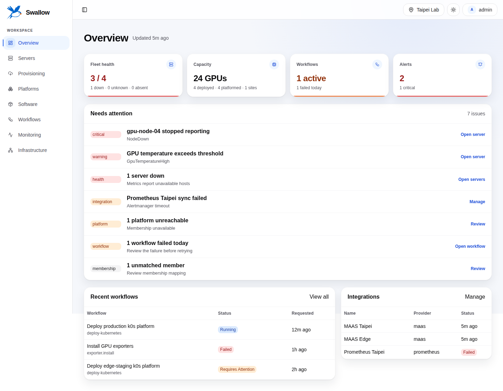
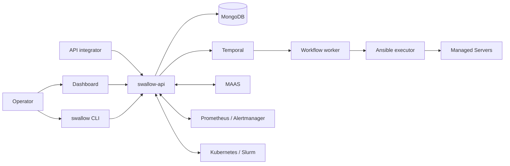

# swallow

[繁體中文](README.zh-TW.md) · [Documentation](docs/en/README.md) ·
[Contributing](CONTRIBUTING.md)

> **Project status: active development.** Interfaces and installation assets are
> evolving, and the repository does not currently publish a stable SemVer
> release. Evaluate upgrades and operational procedures before production use.

swallow is a GPU datacenter management system for operators who need one place
to correlate physical servers, operating-system provisioning, Kubernetes or
Slurm Platforms, host software, automation progress, and monitoring signals.
It owns intent, policy, and identity mapping while external systems continue to
own the facts they are best at producing.



## What swallow does

- Reconciles MAAS machine inventory into stable Server identities.
- Deploys and releases operating systems, including image upload and
  verification, templates, disk/RAM targets, and recovery workflows.
- Deploys and manages self-deployed Kubernetes and Slurm Platforms.
- Installs and removes managed host software such as Docker CE, Podman, and NFS.
- Runs durable automation as Workflows, Jobs, and Tasks through Temporal and
  pinned Ansible content.
- Correlates Prometheus metrics and Alertmanager alerts with Server and Platform
  identities without storing metrics itself.
- Provides complementary operator access through a browser Dashboard and the
  `swallow` CLI; Managed Software is currently available through the Dashboard
  and HTTP API.

## How it fits together



MAAS owns machine and provisioning facts. Kubernetes and Slurm own live runtime
state. Prometheus and Alertmanager own metrics and alerts. swallow owns the
operator's desired state and the stable relationships between those systems.

## Try it locally

The development stack requires Docker Engine with the Compose plugin; Go, Node,
MongoDB, Temporal, and Ansible tooling run in containers.

```bash
git clone git@github.com:maple52046/swallow.git
cd swallow/deploy/dev
docker compose up -d
```

Open <http://localhost:5173> and sign in with `admin` / `admin`. These
credentials and the bundled secrets are for local development only. The API is
available at <http://localhost:30051>.

Continue with the [getting-started guide](docs/en/getting-started.md) to create a
Site, register integrations, configure automation, and use the CLI.

## Interfaces

| Interface | Purpose | Entry point |
| --- | --- | --- |
| Dashboard | Daily operator workflows and diagnostics | [Dashboard guide](docs/en/guides/dashboard.md) |
| `swallow` CLI | Interactive operation and automation-friendly output | [CLI guide](docs/en/reference/cli.md) |
| HTTP API | External integrations against the active `/api/v1` contract | [API integration](docs/en/reference/api-integration.md) |

## Repository components

| Component | Role | Artifact |
| --- | --- | --- |
| [`api-server/`](api-server/) | HTTP API, reconciliation, durable workflow activities, and automation execution | `swallow-api` |
| [`dashboard/`](dashboard/) | React operator console | static web application |
| [`cli/`](cli/) | HTTP operator client | `swallow` |
| [`deploy/`](deploy/) | Development, testing, installation, release, and third-party assets | Compose/native bundles |

For the complete repository map, see the
[codebase structure contract](docs/development/codebase-structure.md).

## Documentation

- [Documentation home](docs/en/README.md)
- [Product introduction](docs/en/introduction.md)
- [Installation choices](docs/en/installation.md)
- [Core concepts](docs/en/concepts.md)
- [Troubleshooting](docs/en/troubleshooting.md)
- [Contributor guide](CONTRIBUTING.md)

The public guides link to provider-owned API contracts, glossary terms, and
architecture decisions where precise implementation or compatibility details
matter. Those development documents remain the source of truth.

## Current limitations

- No stable SemVer release has been published from this repository.
- Native Ubuntu packaging is a preview because native Temporal and PostgreSQL
  systemd packaging is not complete. Use the Compose topology for functional
  Workflow execution.
- User management, Teams, physical rack topology, and GPU-specific observability
  are planned concepts, not active product capabilities.

## Contributing

Start with [CONTRIBUTING.md](CONTRIBUTING.md). Changes must preserve component
boundaries, use the provider-owned API contract, follow the shared glossary, and
include the required tests and documentation updates.
