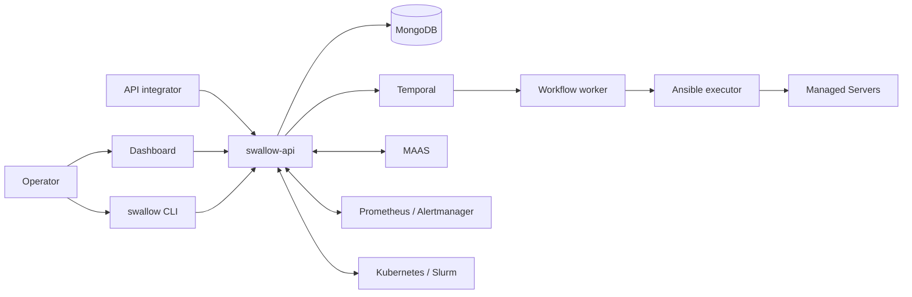

# swallow

[English](README.md) · [文件](docs/zh-TW/README.md) ·
[參與貢獻](CONTRIBUTING.zh-TW.md)

> **專案狀態：積極開發中。** 介面與 installation assets 仍在演進，repository
> 目前尚未發布穩定的 SemVer release。正式環境採用前，請先自行驗證升級與操作流程。

swallow 是提供給 GPU 資料中心 operator 的管理系統，將實體 Server、作業系統佈署、
Kubernetes／Slurm Platform、host software、自動化進度與監控訊號關聯在同一個操作面。
swallow 擁有 intent、policy 與 identity mapping；外部系統繼續擁有其最擅長產生的事實。


## swallow 能做什麼

- 將 MAAS machine inventory reconcile 成穩定的 Server identity。
- 佈署與 release 作業系統，包含 image upload／verification、template、disk／RAM
  deploy target 與 recovery Workflow。
- 佈署及管理 swallow 自行佈署的 Kubernetes 與 Slurm Platform。
- 安裝或移除 Docker CE、Podman、NFS 等 Managed Software。
- 透過 Temporal 與版本固定的 Ansible content 執行 durable Workflow、Job 與 Task。
- 將 Prometheus metrics、Alertmanager alerts 與 Server／Platform identity 關聯，
  但不自行儲存 metrics。
- 透過 Dashboard 與 `swallow` operator CLI 提供互補的操作入口；Managed
  Software 目前由 Dashboard 與 HTTP API 操作。

## 系統關係



MAAS 擁有 machine 與 provisioning facts；Kubernetes／Slurm 擁有即時 runtime
state；Prometheus／Alertmanager 擁有 metrics 與 alerts。swallow 擁有 operator 的
desired state，以及這些系統間穩定的關聯。

## 本機試用

開發環境只需要 Docker Engine 與 Compose plugin；Go、Node、MongoDB、Temporal
與 Ansible toolchain 都在 container 內執行。

```bash
git clone git@github.com:maple52046/swallow.git
cd swallow/deploy/dev
docker compose up -d
```

開啟 <http://localhost:5173>，以 `admin` / `admin` 登入。這組帳密與 bundled
secrets 只能用於本機開發。API 位於 <http://localhost:30051>。

接著閱讀[快速入門](docs/zh-TW/getting-started.md)，建立 Site、註冊 integration、
設定 automation 並開始使用 CLI。

## 操作介面

| 介面 | 用途 | 入口 |
| --- | --- | --- |
| Dashboard | 日常操作流程與診斷 | [Dashboard 指南](docs/zh-TW/guides/dashboard.md) |
| `swallow` CLI | 互動操作與適合自動化處理的輸出 | [CLI 指南](docs/zh-TW/reference/cli.md) |
| HTTP API | 依 active `/api/v1` contract 建立外部整合 | [API integration](docs/zh-TW/reference/api-integration.md) |

## Repository components

| Component | 職責 | Artifact |
| --- | --- | --- |
| [`api-server/`](api-server/) | HTTP API、reconciliation、durable workflow activity 與 automation execution | `swallow-api` |
| [`dashboard/`](dashboard/) | React operator console | static web application |
| [`cli/`](cli/) | HTTP operator client | `swallow` |
| [`deploy/`](deploy/) | Development、testing、installation、release 與 third-party assets | Compose/native bundles |

完整 repository map 請見
[codebase structure contract](docs/development/codebase-structure.md)。

## 文件

- [文件首頁](docs/zh-TW/README.md)
- [專案介紹](docs/zh-TW/introduction.md)
- [Installation 選擇](docs/zh-TW/installation.md)
- [核心概念](docs/zh-TW/concepts.md)
- [疑難排解](docs/zh-TW/troubleshooting.md)
- [貢獻指南](CONTRIBUTING.zh-TW.md)

公開指南會在需要精確實作或相容性細節時，連到 provider-owned API contracts、
glossary terms 與 architecture decisions；那些 development documents 仍是權威來源。

## 目前限制

- Repository 尚未發布穩定 SemVer release。
- Native Ubuntu packaging 仍是 preview，因為 native Temporal 與 PostgreSQL
  systemd packaging 尚未完成。需要執行 Workflow 時請使用 Compose topology。
- User management、Teams、實體 rack topology 與 GPU-specific observability 都是
  planned concepts，不是目前的 active capability。

## 參與貢獻

請從 [CONTRIBUTING.zh-TW.md](CONTRIBUTING.zh-TW.md) 開始。任何變更都必須維持
component boundaries、使用 provider-owned API contract、遵循 shared glossary，
並完成必要的測試與文件更新。
