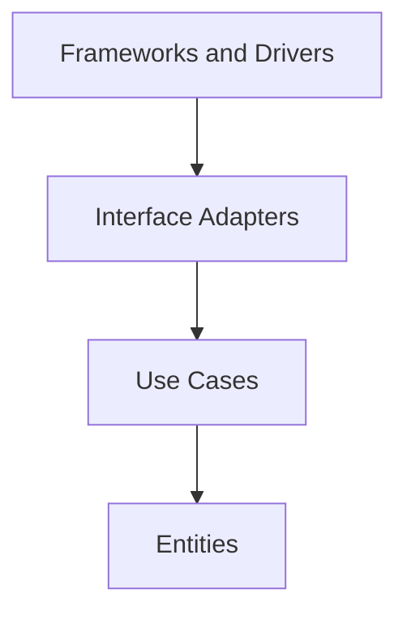

# Swallow Architecture Spec

本文件定義本 project 的架構開發原則，適用於所有開發人員與 AI agent。

本 project 採用 Clean Architecture 作為主要架構原則。實作時必須讓核心業務規則獨立於 framework、database、UI、外部服務與安裝／執行環境細節。

本文整理自 [The Clean Architecture](https://blog.cleancoder.com/uncle-bob/2012/08/13/the-clean-architecture.html)，並搭配 Go 撰寫規範 [`coding-style.md`](coding-style.md) 使用。

## 核心目標

本 project 的設計必須滿足以下目標：

- Separation of concerns：不同責任必須分層，業務規則、應用流程、轉接器與外部工具不得混在一起。
- Independent of frameworks：Fiber、gRPC、Cobra 是工具，不是核心架構的中心。
- Testable：business rule 與 use case 必須能在不啟動 MongoDB、HTTP server、gRPC server 或外部服務的情況下測試。
- Independent of UI：介面形式（HTTP、gRPC、CLI）可以替換，不得影響核心業務規則。
- Independent of database：MongoDB 與其 driver 是外層細節，不得污染內層模型與 use case。
- Independent of external agencies：核心邏輯不應知道第三方 API、傳輸協定、作業系統或雲端服務的細節。

## Component Boundary

`api-server` 是 swallow monorepo 中的一個 component：Data Center API Service，提供 swallow 的 HTTP REST API 與背景 reconcile / poll 迴圈。

同一個 monorepo **不等於** 共用 component 邊界。修改程式碼或契約前，必須先辨識受影響的 component，並在該 component 的責任範圍內工作。`api-server` 是 API provider 並擁有 API contract；`dashboard` 是下游 consumer。（早期的節點端 `agent` component 已依 [ADR 001](../../../docs/decisions/001-system-ownership-boundaries.md) 退場。）

## Dependency Rule

Clean Architecture 最重要的規則是 Dependency Rule：source code dependencies 只能指向內層。



依賴方向代表：

- 外層可以知道內層。
- 內層不得 import、引用、命名或依賴外層。
- 內層不得接受外層 framework 的資料型別，例如 `*fiber.Ctx`、gRPC request/response message、`bson.M`、Mongo cursor、YAML 節點。
- 外層變更不應迫使內層業務規則變更。

Go compiler 只禁止 import cycle，不理解分層，因此方向必須靠 package 紀律與 review 維持。具體到本 project：

- `internal/<feature>/domain` 只 import standard library（`context`、`time`、`errors`）與必要的 value helper。
- `internal/<feature>/application` 只 import 自己的 `domain` 與 `internal/shared` 的抽象。
- `internal/<feature>/delivery` 與 `internal/<feature>/infra` 是外層，可向內 import；沒有任何內層 import 它們。
- `internal/app` 是唯一同時 import `delivery` 與 `infra` 的 package，它的職責就是 wiring。

兩條必須明講的結論：`*fiber.Ctx` 不得出現在 `delivery` 之外；`bson` tag、Mongo filter 與 `mongo.ErrNoDocuments` 不得出現在 `infra` 之外。`gen/` 下的 generated protobuf message 是 transport 型別，必須在 `delivery` 內轉成 domain 型別。

若流程控制需要由內層呼叫外層能力，必須使用依賴反轉：內層定義需要的 port/interface，外層提供實作。

## 建議層次

實際目錄名稱可依專案演進調整，但責任邊界必須清楚。

### Entities

Entities 是最內層，負責核心商業概念與跨 use case 的穩定規則，位於 `internal/<feature>/domain`。

Entities 可以包含：

- Domain type、value object、aggregate。
- 不依賴外部系統即可執行的業務規則。
- 業務 invariant 與狀態轉換。
- Sentinel error（例如 `ErrServerNotFound`）與 domain 錯誤語意。
- Port interface：本 project 讓內層擁有 port（見下方「介面與依賴反轉」）。

Entities 不得包含：

- Database schema、`bson`/`json` tag 只為序列化服務的欄位、Mongo document mapping。
- HTTP、gRPC、CLI 或 queue payload 型別。
- 外部 SDK 型別。
- Framework lifecycle、config 讀取或安裝／執行環境設定。

### Use Cases

Use cases 描述應用程式特定的業務流程，負責協調 entities 與 ports，位於 `internal/<feature>/application`，一個操作一個檔案。

Use cases 可以包含：

- Application service、command/query handler。
- 授權判斷與應用層規則。
- Transaction boundary 的抽象需求。
- 對 repository、clock、ID generator、token issuer 等 port 的呼叫。

Use cases 不得包含：

- Mongo query、HTTP routing、Fiber handler、gRPC server、middleware。
- 具體資料庫 client 或外部 SDK 呼叫。
- Response format、status code 或傳輸協定格式。

### Interface Adapters

Interface adapters 負責轉換內層與外層之間的資料格式。

Interface adapters 可以包含：

- `internal/<feature>/delivery`：Fiber HTTP handler、gRPC handler、request 解析、response 與 error shaping。
- `internal/<feature>/infra`：repository implementation（例如 `mongo_server_repo.go`）。
- `internal/shared/{apierror,jwt,middleware,pagination}`：跨 feature 共用的 adapter 層關注點。
- DTO 與 mapper：把 HTTP request、protobuf message、Mongo document 轉成 use case input。

Interface adapters 必須避免把外層格式直接傳入 use case 或 entity。

### Frameworks and Drivers

Frameworks and drivers 是最外層，負責具體工具與執行環境。

這一層可以包含：

- `cmd/swallow-api`：Cobra CLI entry point（binary `swallow-api`）。
- `internal/app`：composition root（`RunAPI`、`RunAgent`），負責組裝與啟動。
- `config`：config 組裝與驗證（file、env、flag、default 的優先順序）。
- `bootstrap`：一次性啟動任務（例如 admin seeding）。
- Fiber server、gRPC server/client、Mongo client、logging。
- `proto/` 定義與 `gen/` generated code。

外層程式碼應保持薄，主要負責 wiring、configuration 與 glue code。`gen/` 是產生物，永不手改。

## 專案目錄對應

```text
.
├── cmd/swallow-api/                 # CLI entry point (Cobra): api, worker, migrate, ansible-executor
├── bootstrap/                       # 一次性啟動任務（admin seeding）
├── config/                          # config 組裝 + 驗證，單一擁有者
├── internal/
│   ├── app/                         # composition root: RunAPI, RunAgent
│   ├── <feature>/                   # vertical slice，例如 auth、server
│   │   ├── domain/                  # entities、value type、port、sentinel error
│   │   ├── application/             # use cases，一個操作一個檔案
│   │   ├── delivery/                # HTTP (Fiber) 與 gRPC handler
│   │   └── infra/                   # driver adapter（Mongo…）
│   ├── agent/                       # agent 端關注點：detect、identity、state
│   └── shared/                      # apierror、jwt、middleware、pagination
├── proto/                           # protobuf 定義（source of truth）
├── gen/                             # generated protobuf code — 永不手改
├── tests/                           # 跨層 / integration 測試
└── docs/                            # 開發規範、API contract、config 參考
```

目錄規則：

- `domain/` 不得 import 同 feature 的 `application/`、`delivery/`、`infra/`，也不得 import 任何 driver 套件。
- `application/` 可 import `domain/`，不得 import `delivery/` 或 `infra/`。
- `delivery/` 與 `infra/` 可 import `domain/` 與 `application/`，負責格式轉換與 port 實作。
- `internal/app/` 可知道所有外層工具，並在 composition root 完成 wiring。
- `internal/shared/` 只放跨 feature 真正共用的東西；它不得包含任何單一 feature 的業務規則。
- 新增 feature 時建立完整 slice，不得為了省事把 use case 塞進 handler。

若功能尚小，可以先用較少檔案，但新增程式碼時仍必須能指出它所屬的 Clean Architecture 層次。

## 資料穿越邊界

跨層傳遞資料時，資料格式必須以內層最容易理解與維護的形式為準。

- 進入 use case 前，HTTP request body、query string、protobuf message、Mongo document 必須先轉成內層 input model 或簡單 value。
- Use case 回傳給外層時，應回傳 domain 型別或內層 result model，再由 adapter 轉成 HTTP response、gRPC response 或 Mongo update。
- 不得把 `*fiber.Ctx`、protobuf message、`bson.M`、Mongo cursor 或第三方 SDK response 傳入 entities/use cases。
- 跨邊界資料應使用清楚、穩定、低耦合的 struct、primitive value 或明確的 domain type。

```go
// Good: use case receives an input model defined for the application rule.
type CreateServerInput struct {
	Hostname string
	IP       string
}

// Bad: use case depends on transport details.
func CreateServer(c *fiber.Ctx) error
```

Persistence document 與 domain type 不應共用同一個 struct，除非該 struct 已被明確定義為穩定的內層契約且有文件說明其跨邊界語意。

## 介面與依賴反轉

Interface 是用來保護內層規則，不是用來裝飾每個 struct。

- Port/interface 由使用端的需求驅動，描述 use case 真正需要的能力。
- Port 應保持小而明確，避免把 driver 的完整 API 洩漏進內層。
- 外層實作內層定義的 port，例如 repository、token issuer、clock。
- 不為了「未來可能替換」建立空泛 abstraction；只有在跨邊界或測試隔離需要時才引入。

```go
// Good: the domain owns the persistence need.
type ServerRepository interface {
	Create(ctx context.Context, server *Server) error
	FindByID(ctx context.Context, id string) (*Server, error)
}
```

本 project 刻意把 port 宣告在 `domain`（而非依 Go 慣例由 consumer package 宣告），因為 Clean Architecture 要求依賴箭頭指向內層。這個取捨帶來的義務仍是 Go 的標準義務：interface 要小、只放 core 真正需要的方法、在 interface 上寫清楚契約、accept interfaces 並 return concrete types。**不要把它「修正」回 consumer-defined interface**，那會破壞依賴方向。

Use case 透過建構參數取得 port。`domain` 與 `application` 不建立 adapter、不讀 config、不使用 package-level singleton。

## 錯誤與交易邊界

- Use case 應回傳具有業務語意的 error，避免暴露 Mongo、HTTP 或外部 SDK 的原始錯誤型別。
- `infra` 負責把 driver 錯誤轉成 domain error（例如把 `mongo.ErrNoDocuments` 轉成 `ErrServerNotFound`）。
- `delivery` 負責把 domain error 透過 `internal/shared/apierror` 轉成 HTTP status 或 gRPC status；status code 不得成為業務規則的一部分。
- Transaction boundary 屬於 use case 的需求，但具體 transaction implementation 屬於外層。
- 不得讓 entity 依賴 transaction、database session 或 request context 以外的框架狀態。

## Config 邊界

Config 只有一個方向：`config` package 從 file、env、flag、default 組裝並驗證出一個 value object，`internal/app` 收到的是完整組裝好的 config。

- 任何下層 package 不得讀 `os.Getenv` 或 flag。
- Config 的優先順序與 fallback 行為屬於 `config` package 的契約，必須以註解說明。
- 需要設定值的內層程式碼，透過建構參數取得它需要的最小欄位，不接收整個 config struct。

## 測試要求

- Entities 必須能用純 unit test 驗證，不需要 mock 外部系統。
- Use cases 必須能以 fake 或 in-memory port implementation 測試，不需要啟動 MongoDB、HTTP server 或 gRPC server。
- Interface adapters 應測試資料轉換、錯誤映射與 framework integration。
- Frameworks and drivers 測試應集中在 wiring 與 integration，不應重測內層業務規則。
- 跨層與端到端測試放在 `tests/`；單元測試放在被測程式碼旁的 `_test.go`。
- 若某段核心邏輯難以測試，通常代表依賴方向或責任邊界需要調整。

## 禁止事項

以下做法違反本 project 的 Clean Architecture 原則：

- Entity 或 use case import `infra`、`delivery`、Fiber、gRPC、Mongo driver、Cobra 或 `gen/`。
- Use case 直接下 Mongo query、呼叫 HTTP client、操作 gRPC stream 或讀取 config/env。
- 內層函式接受 `*fiber.Ctx`、protobuf message、`bson.M`、Mongo document 或第三方 SDK response。
- 在 domain type 放入只服務持久化或傳輸的欄位或 tag，除非該 tag 是內層穩定資料契約的一部分且有文件說明。
- 為了共用方便，把跨層資料結構放到 `common`、`util`、`model` 等模糊 package。
- 讓 HTTP status code、Mongo error 或 protobuf 欄位形狀成為業務規則的一部分。
- 在 handler、router 或 repository implementation 內實作業務規則（例如註冊策略、授權判斷、狀態轉換）。
- 因為測試困難而跳過測試，而不是修正架構邊界。
- 手改 `gen/` 內的 generated code，而不是改 `proto/` 後重新產生。

## Agent 執行規則

AI agent 新增或修改本 project 程式碼時必須遵守以下規則：

- 修改前先確認工作屬於 `api-server` component，再判斷目標程式碼屬於 entity、use case、interface adapter 或 framework/driver。
- 新增 import 時檢查依賴方向；內層不得 import 外層。
- 新增跨層資料傳遞時，確認資料格式由內層定義或對內層友善。
- 新增外部工具、framework、SDK、DB 或 transport 整合時，只能放在外層，並透過 port/interface 連接內層。
- 修改 use case 或 entity 時，必須保持不需要啟動外部系統即可測試。
- 若需要新增 interface，先確認它是否由使用端需求驅動，而不是為了包裝具體實作。
- 修改 API 行為前，必須先依 [`api-contracts/README.md`](api-contracts/README.md) 更新或建立 provider-owned contract。
- 修改 architecture contract、資料邊界或依賴方向時，必須同步更新文件與測試。
- 必須遵守 [`coding-style.md`](coding-style.md) 的 Go 註解、命名、錯誤處理與測試規範。
