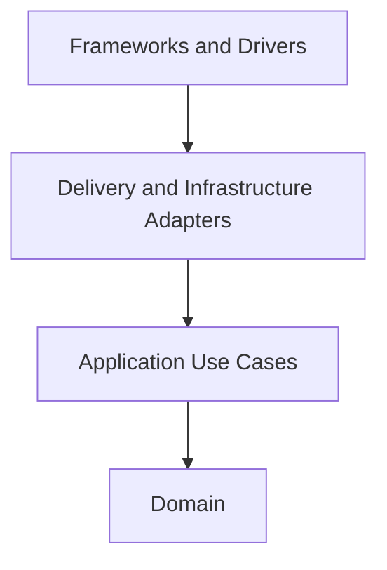

# API Server Architecture Spec

本文件是 `api-server` component 的 Clean Architecture constitution。Root
architecture spec、shared glossary 與 provider-owned API contracts 同時適用；
本文件不得覆蓋它們。

## Component Boundary

`api-server` 是 swallow 唯一 API provider，負責：

- HTTP REST API、authentication 與 authorization。
- Swallow-owned intent、policy、stable identity mapping 與 projections。
- Provisioner／Platform／monitoring reconciliation 與 query adapters。
- Temporal-based durable Workflow orchestration。
- Versioned Ansible content 與 execution attempts。

`dashboard` 與 `cli` 是 conformist HTTP consumers，只能透過 published
contract 整合。`api-server` 不發布 HTTP 以外的 public protocol。

## Runtime Topology

同一個 `swallow-api` binary 提供四個 process role：

- `api` — HTTP delivery、queries、reconciliation loops 與 Workflow start/control。
- `worker` — Temporal Workflow definition 與 activities。
- `ansible-executor` — 執行 idempotent Ansible attempt、保存 artifacts、發布 events。
- `migrate` — service startup 前的 explicit migration。

Temporal 是唯一 durable orchestration engine。API process 不執行 in-process
fallback。完整 execution topology 還需要 Temporal Server/PostgreSQL、MongoDB、
worker 與 ansible-executor。

## Dependency Rule

Source dependencies 只能向內：

- `internal/<feature>/domain` 定義 entity、value、invariant、domain error 與
  inner-owned port。不得 import Fiber、MongoDB、Temporal、Ansible、provider SDK
  或 config。
- `internal/<feature>/application` 實作 use case，協調 domain 與 port。不得
  import delivery／infra implementation。
- `internal/<feature>/delivery` 將 HTTP transport 映射到 use-case input/output。
- `internal/<feature>/infra` 實作 MongoDB、MAAS、Prometheus/Alertmanager、
  Kubernetes、Slurm 等 adapters。
- `internal/app` 是 composition root，可組合 delivery、infra、loops 與 runtime
  process。
- `cmd/swallow-api` 只負責 Cobra command、signal/context、config load 與啟動。

內層不能接受 `*fiber.Ctx`、`bson.M`、Mongo cursor、Temporal activity context、
Ansible event、provider SDK response 或 YAML node。

## Feature Slices

目前主要 vertical slices 包含：

- `auth` — login 與 current identity。
- `site`／`infrastructure` — Sites、Integrations、Zones、Pools。
- `server` — stable Server projection 與 event stream。
- `provisioning` — MAAS adapter、images、templates、tags、network、deploy/release/recovery。
- `platform` — Kubernetes／Slurm deployment policy、credentials、membership、live APIs。
- `software` — Managed Software catalog、Assignments 與 lifecycle intent。
- `operation` — Workflow/Job/Task domain、execution records、artifacts 與 runners。
- `monitoring`／`overview`／`discovery` — read models 與 external live queries。
- `migration` — explicit schema/data evolution。

Feature 間不得直接 import 對方 infra implementation。Cross-feature coordination
透過 application port 或 `internal/app` adapter 組合。

## Data Crossing Boundaries

- Delivery 先 parse／validate HTTP request，再轉成 application input。
- Application/domain 回傳 stable inner type，由 delivery shape response 與 status。
- Infra 將 Mongo document、provider response、Temporal payload、Ansible event
  映射成 inner type。
- Persistence document 與 API DTO 不得直接成為 domain entity。
- Shared wire helpers（timestamp、pagination、API error）只承載 cross-feature
  transport concern，不承載 feature business rule。

## Ports and Dependency Inversion

Port 由內層需要的能力驅動，應小而精確。例如 repository、clock、ID generator、
provider capability、Workflow starter 或 metrics query。外層實作 port，再由
composition root 注入。

Interface 不用來包裝每個 concrete type；只有需要保護 boundary、替換 driver
或隔離測試時才建立。

## Provider Ownership

MAAS、Kubernetes／Slurm、Prometheus／Alertmanager 分別擁有其 external facts。
Swallow 只保存 identity mapping、intent、policy 與必要 projection。

對 provisioner 可能擁有的 fact 使用 capability-first with swallow-owned fallback：

- provider 有 capability 時，它是 source of truth，reconcile mirror observation；
- provider 無 capability 時，swallow own 同形狀 fallback；
- capable/non-capable 分支與 effective-value merge 集中在 adapter/use case；
- owned fallback 不回寫不支援該能力的 provider。

## Durable Workflow Boundary

- Application 建立 intent 與 durable Workflow record，不直接長時間 block HTTP request。
- Temporal Workflow code 必須 deterministic；I/O、clock、randomness、provider call
  與 Mongo write 留在 activity。
- Activity 使用 idempotency key，並安全處理 replay/retry。
- Site/resource lease 保護 conflicting work；lock gate 在 application boundary 執行。
- Ansible executor 只接受 manifest allowlist 內的 playbook，credential 經 write-only
  secret boundary 傳遞，event/artifact 不得洩漏 secret。
- 無法證明 external side effect 的 expired run 變成 `indeterminate`，不得自動 retry。

## Configuration Boundary

`config` package 是唯一 file/env/flag/default merge owner。Priority 為 environment、
flag、file、default。Validation 在 merge 後執行。

下層 package 不得讀 `os.Getenv` 或 Cobra flag。Composition root 只將最小所需
configuration 傳入 adapter/use case。Credential key、JWT、machine token、
Temporal、artifact path、retention、parallelism 等 security/lifecycle semantics
必須有維護性註解。

## Error Boundary

- Domain/application 回傳具有業務語意的 error，不暴露 driver error。
- Infra 將 Mongo/provider/Temporal/Ansible error 翻譯為 inner error。
- Delivery 透過 shared API error mapping 產生 contract-defined status、code、
  message 與 request ID。
- Error message 給人閱讀；consumer 只能對 code 分支。

## Testing

- Domain unit tests 不需要 MongoDB、HTTP、Temporal 或 provider。
- Application tests 使用 fake ports，涵蓋 invariant、conflict、rollback/recovery。
- Delivery tests驗證 request/response mapping、auth、status 與 error envelope。
- Infra tests驗證 mapping、Mongo uniqueness、provider capability 與 runner behavior。
- Temporal tests需涵蓋 deterministic replay、worker restart、activity retry/cancel。
- Cross-layer tests 放在 `tests/`；unit tests 與 source 同 package。

若核心規則只能靠 live external system 驗證，代表 boundary 需要重構。

## Prohibited Designs

- Domain/application import outer framework 或 concrete adapter。
- Handler、repository、Temporal Workflow definition 或 playbook catalog 內散落 business rule。
- API behavior 沒有 Active contract。
- Consumer 依賴 private struct、Mongo document 或 implementation enum。
- 在 API process 建立第二套 in-process Workflow execution engine。
- 直接執行未在 release manifest 登錄的 playbook。
- 將 credential、token、private key 或 become password 寫入 log/event/artifact。
- 以 hostname／IP 取代 opaque Server identity。

## Completion Gate

任何 code change 必須：

1. 先確認 glossary 與 Active API contract。
2. 保持 dependency direction 與 provider ownership。
3. 執行 `gofmt -l .`、`go vet ./...`、`go test ./...`、`go build ./...`。
4. 依 coding style 手動檢查 changed Go files 的 comments、security、concurrency、
   cleanup 與 compatibility。
5. 同步更新 contract、glossary、architecture、tests 與 public docs（若 user-visible）。
