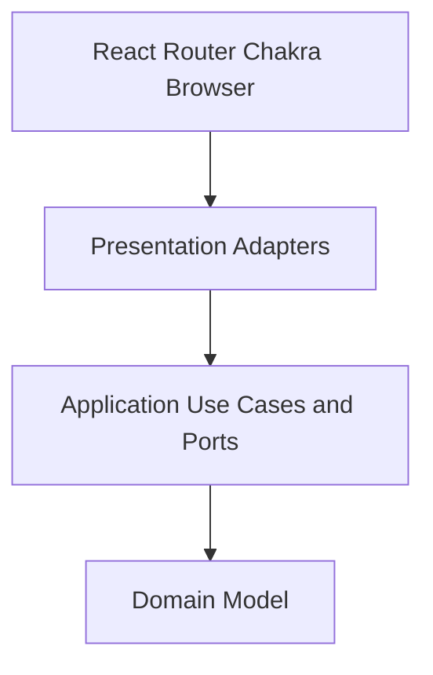

# Dashboard Architecture Spec

本文件是 `dashboard` component 的 Clean Architecture constitution。Root
architecture spec、shared glossary 與 api-server published contract 同時適用。

## Component Boundary

`dashboard` 是 `api-server` HTTP API 的 conformist consumer。它負責 operator
interaction、presentation state、browser lifecycle 與 accessibility，不擁有 API
contract、provider fact 或 backend policy。

Production composition 只綁定 real HTTP adapters。Playwright API fixtures 是
deterministic test drivers，不是 runtime implementation 或 contract source。

## Dependency Rule



- `src/domain/` 不得 import React、router、Chakra、HTTP、storage 或 browser API。
- `src/application/` 可 import domain，擁有 ports/use cases，不得 import
  infrastructure、presentation 或 React。
- `src/infrastructure/` 實作 HTTP/browser-storage adapters，將 transport DTO
  映射到 domain/application types。
- `src/presentation/` 組合 pages、components、hooks、contexts 與 accessible UI，
  不得 import `@/infrastructure/**`。
- `src/di/` 是唯一 composition root，可看到 ports 與 implementations。
- `src/router.tsx`／`src/main.tsx` 是 framework entry points。

## Directory responsibilities

```text
src/
├── domain/<area>/             concepts, enums, invariants
├── application/
│   ├── ports/                 inner-owned data/effect interfaces
│   └── usecases/              workflows with real application logic
├── infrastructure/
│   ├── api/                   HTTP clients, DTOs, mappers, SSE
│   └── persistence/           browser preferences/session adapters
├── presentation/
│   ├── app/                   shell, navigation, theme
│   ├── pages/                 routed operator workspaces
│   ├── components/            reusable accessible UI
│   ├── contexts/              cross-page presentation state
│   └── hooks/                 React lifecycle adapters
├── di/                        container and provider
├── shared/                    framework-free generic helpers
├── router.tsx
└── main.tsx
```

`shared/` 不得成為模糊 business-logic dumping ground，也不得 import 任何 layer。

## Data Crossing Boundaries

- API DTO 只存在 infrastructure；map 後才進入 application/domain/presentation。
- Domain/application 不接受 `Response`、`URLSearchParams`、route object、
  DOM event、storage record 或 Chakra props。
- Route/query/form input 在 presentation adapter 轉成 typed application input。
- View-specific formatting 留在 presenter/component，不污染 domain value。
- Opaque IDs 保持 identity；hostname/address 只作 display。

## Ports and Use Cases

Port 描述 UI 真正需要的 capability，使用 domain language，回傳 inner types。
Adapter 以 driver 命名並集中 transport/auth/error mapping。

不需要額外邏輯的單純 CRUD 可由 container 暴露 repository port；多來源協調、
eligibility、working-set refresh 或 presentation-independent rule 才建立 use case。
不得建立只 passthrough 的 use case layer。

## React and Presentation

- Page 組合 hooks、ports/use cases 與 reusable presentation components。
- Hook 處理 React lifecycle/network cancellation，不承載可獨立測試的 business rule。
- `useEffect` 只同步 external world，不用來建立 domain invariant。
- Loading、empty、error、success 使用互斥 state model，不以矛盾 booleans 表示。
- URL owns shareable filters/scope；browser storage 只保存 UI preference/session。
- Status、error、staleness 與 destructive consequence 必須文字化，不只靠色彩。

## Session and credentials

- Access token 只存在 `src/infrastructure/api/session.ts` 的記憶體中，不寫入 `localStorage`；refresh token
  是網頁讀不到的 HttpOnly cookie（decision 042）。Presentation 永遠拿不到任何 token，只透過
  `AuthRepository` 取得 domain User。
- `apiRequest`／`apiRequestText`／`apiUpload` 在 token 即將到期時先換發，收到 `401` 時換發一次並重送；
  換發本身是同分頁 single-flight、跨分頁以 Web Locks 排隊。換發失敗時 adapter 發出 session-ended
  訊號，由 `AuthContext` 清除使用者並交給 `ProtectedRoute` 帶著原位置導回 login。
- Event stream（SSE）以 access token query parameter 連線；瀏覽器放棄連線時由 adapter 換發後以
  backoff 重連。API key 只供 CLI／script 使用，dashboard 不會以 API key 驗證。

## API and Error Boundary

- Adapter 使用 Active provider contract，不從 backend code 猜測 behavior。
- Shared error envelope 轉成 typed client error；UI 顯示 human message 與 request ID。
- `401` 先嘗試換發一次，失敗才結束 session；role visibility 不取代 server authorization。
- SSE ownership、reconnect/backoff、abort/cancellation 與 cleanup 必須集中且有註解。
- Unknown enum 使用 least-privileged/safe presentation，不 fail open。

## Experimental features

開發中的 dashboard 功能（目前為 `monitoring`、`osImageUpload`、`deploymentTemplates`）只在
development build（Vite dev server，含 Playwright）顯示；release build（`vite build`）一律隱藏。
這只影響 presentation，不改 API、CLI 或後端行為。

- Feature 清單與 `ExperimentalFeatureSettings` port 在 `src/application/ports/`。
- `src/di/container.ts` 是唯一讀取 build mode（`import.meta.env.DEV`）的地方：development 綁定
  localStorage 實作（`swallow.dev.experimentalFeatures`，預設全開、只存關閉的項目），release 綁定
  永遠關閉且不可調整的實作。Presentation 不得自行判斷 `import.meta.env`。
- Presentation 以 `useExperimentalFeature(feature)` 讀取。獨立入口（navigation、tab、action、
  route）在關閉時移除；route 一律經 `FeatureRoute` 保護（Not Found 或保留 query string 的 redirect），
  避免書籤或手打 URL 掛載未完成畫面並發出其 API request。
- 共用頁面上的值（例如 health）在關閉時保留位置，統一使用 `NOT_AVAILABLE_IN_RELEASE` 文案，
  不顯示成空值、unknown 或 failure；依賴該功能的 URL filter 在 parse 時忽略、在 canonicalize 時移除。
- Development build 在帳號選單提供「Experimental features」對話框，逐項切換並即時重繪。
- 新增實驗功能時：擴充 `ExperimentalFeature` 與對話框文案，gate 所有入口，並在
  `tests/e2e/experimental-features.spec.ts` 與 `tests/production/` 補驗證。功能完成後移除 gate 與清單項目。

## Shared UI and DRY

同一功能只有一個 canonical composed component。Server summary、status badges、
dialogs、release options、pagination、loading/error/empty states 等須 reuse/extend，
不得在 page 間 copy-paste。差異以 typed props 或 composition 表達。

## Accessibility

- 使用 semantic control、label、heading hierarchy 與 keyboard interaction。
- Modal focus、escape/close、async busy state 與 error announcement 必須可用。
- Status 不只以 color 表達；icon 也需要 accessible name 或 decorative treatment。
- Table 在 narrow viewport 需提供等價 responsive view。
- Destructive action 必須清楚描述 target、consequence 與不可逆性。

## Testing

`npm run test:e2e` 使用 Playwright（Vite dev server）；`npm run test:e2e:production` 以
`vite build` + `vite preview` 驗證 release build 隱藏實驗功能：

- deterministic API fixtures 驗證 operator journeys；
- active route、auth、action、failure/recovery behavior；
- 以獨立 visual-review workflow 產生 disposable desktop/mobile screenshots，由
  agent 或 developer 實際開啟檢查，不進行 pixel-baseline comparison；
- accessibility role 與 visible user outcome。

Domain/use-case logic 應保持可在不 render React、不啟動 browser、不呼叫 live API
的情況下測試。新增 unit runner 前，仍須以純 functions／ports 維持此能力。

## Prohibited Designs

- Domain/application import React、router、Chakra、browser 或 infrastructure。
- Presentation import concrete infrastructure implementation。
- Component/hook 直接依賴 transport DTO 或 parse backend error string。
- Mock/test fixture 進入 production container。
- UI 發明 Planned endpoint、field、enum 或 authorization behavior。
- 將 `null` unknown 呈現成 failure，或製造 combined Server status。
- 以 duplicated composed UI 取代 shared component。

## Completion Gate

任何 source change 必須：

1. 確認 Active provider contract 與 glossary。
2. 保持 layer direction、real-data behavior 與 accessibility。
3. 執行 `npm run lint`、`npm run build` 及相關 functional Playwright tests。
4. User-visible UI 變更使用獨立 visual-review workflow 截取受影響 route 的 dark
   desktop/mobile；theme、color 或 shared-style 變更加驗 light。Agent 必須實際
   開啟 screenshots，修正發現的 layout、responsive 或 contrast 問題後重新檢查。
5. 手動檢查 changed source 的 JSDoc、cleanup、auth/storage、error/loading/empty
   state、responsive behavior 與 shared-component reuse。
6. 同步更新 tests、architecture 與雙語 public docs（若 user-visible）。
