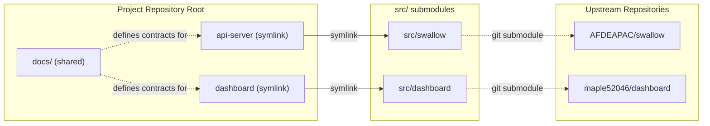

# Codebase 架構總覽

## Purpose

本文件是這個 project repository 的**結構契約 (structure contract)**，
定義整個 project 在檔案系統層級的組成方式、各 sub-project 的對應關係，
以及共通文件 (`docs/`) 與各 sub-project 原始碼 (`src/`) 之間的邊界。

任何協作者或開發者在以下情境必須先閱讀本檔：

- 新增、移除或重命名 component。
- 調整 `src/` 或根目錄的目錄結構。
- 在 `docs/` 中新增跨 sub-project 共用的概念定義。

本檔不描述任何 sub-project 內部的實作細節，
那些屬於各 submodule 自己的 README 與架構文件。

## Definition

這個 project 採用 **submodule + symlink** 的組合來管理多個關聯 sub-project：

- `src/`：以 git submodule 的形式集中保存所有相關 sub-project 的原始碼。
- 根目錄 symlink：以 component 名稱（即 sub-project 在本 project 中扮演的角色）
  指向 `src/<repo>`，讓使用者在路徑上看到的是 component 名稱，而非 repo 名稱。
- `docs/`：保存跨 sub-project 共通的**定義性文件 (definitional documents)**，
  例如 domain glossary、API contract、共通資料模型等。
  其內容組織以 (light) clean architecture / DDD 為基礎，
  目的在於界定 project 範圍內的 ubiquitous language 與跨 sub-project 契約，
  而**不規範**任何單一 sub-project 的內部分層或實作。

名詞釐清：

- **sub-project** — 一個獨立版控的專案（在本 project 中以 git submodule 形式引入）。
- **component** — 一個 sub-project 在本 project 中扮演的角色（例如 `api-server`、`dashboard`）。
- **submodule** — git 機制層面的稱呼，與 sub-project 在本 project 中為同一物件。

## High-Level Layout

```text
.
├── api-server  -> src/swallow      # symlink, component name
├── dashboard   -> src/dashboard    # symlink, component name
├── docs/                           # 跨 sub-project 共通定義性文件
│   └── architecture.md             # 本檔
├── src/                            # 只放 git submodule
│   ├── swallow/                    # submodule: Data Center API Service
│   └── dashboard/                  # submodule: 前端 dashboard
├── .gitmodules
└── .git/
```

## Component 與 Submodule 對應關係



## Conventions / Rules

以下規則為強制性，新增或調整結構時必須遵守：

- `src/` 內**只能**存放 git submodule，不得直接放未受版控的原始碼或工作目錄。
- 每個 component 在 project root **必須**以 symlink 暴露其 component 名稱，
  例如 `api-server -> src/swallow`，理由：
  - 路徑語意接近領域語言，降低對 repo 命名的耦合。
  - 保留 sub-project 自身的版本控管能力。
- 一個 sub-project **可以**對應多個 component symlink
  （例如同一份 repo 同時提供 `api-server` 與 `worker` 兩種角色）。
- `docs/` 內**只**保存跨 sub-project 共通的契約與定義，
  各 sub-project 的內部設計文件留在自己的 submodule 中。
- 不在 project root 直接放任何業務原始碼；
  所有實作必須位於 `src/<submodule>/` 之內。

## Components

目前已註冊的 components：

- **api-server** → [`src/swallow`](../src/swallow)
  - Upstream: `git@github.com:AFDEAPAC/swallow.git`（見 [`.gitmodules`](../.gitmodules)）
  - 對外角色：Data Center API Service，提供本 project 的後端 HTTP API
    （見 [`src/swallow/README.md`](../src/swallow/README.md)）。
- **dashboard** → [`src/dashboard`](../src/dashboard)
  - Upstream: `git@github.com:maple52046/dashboard.git`
  - 對外角色：前端 dashboard，採 React + TypeScript + Vite
    （見 [`src/dashboard/README.md`](../src/dashboard/README.md)）。
  - 與 `api-server` 之間的溝通協議由 [`docs/contracts/`](./contracts) 中的 API contract 定義。

新增 component 時，請於本節以相同格式登錄。

## Docs Layout

`docs/` 依用途扁平劃分為以下類別，類別目錄按需要建立：

- [`docs/architecture.md`](./architecture.md) — project 結構入口（本檔）。
- `docs/glossaries/` — 跨 sub-project 共通的領域術語 (domain glossary)，
  定義本 project 的 ubiquitous language。
- `docs/contracts/` — 跨 sub-project 共通的 API / 資料契約，
  例如 REST endpoint schema、共通 DTO、事件格式。
- `docs/<其他共通定義>/` — 視 project 演進新增（例如 `policies/`、`workflows/`），
  原則同樣為「跨 sub-project 共通、與單一實作無關」。

每個類別目錄內的文件應遵循相同風格：

- 採結構化段落（如 Purpose、Definition、Scope、Fields、Rules、Out of Scope、Related Concepts）。
- 描述 project 範圍內的共識，不描述某個 sub-project 的內部實作細節。

## Operating Conventions

### Clone / Sync

- 初次 clone project：

  ```bash
  git clone --recurse-submodules <project-repo-url>
  ```

- 既有 clone 補拉 submodule：

  ```bash
  git submodule update --init --recursive
  ```

- 同步 submodule 至各自 upstream 最新版本：

  ```bash
  git submodule update --remote
  ```

### 新增一個 Component

1. 將 upstream repo 加為 submodule：

   ```bash
   git submodule add <upstream-url> src/<repo-name>
   ```

2. 在 project root 建立 symlink，使用 component 的角色名稱：

   ```bash
   ln -s src/<repo-name> <component-name>
   ```

3. 在本檔的 [Components](#components) 章節登錄該 component。
4. 若該 component 引入新的共通概念，於 `docs/` 適當子目錄
   （如 `docs/glossaries/` 或 `docs/contracts/`）增補對應定義文件，
   並在本檔 [Docs Layout](#docs-layout) 列出。

### 移除或重命名 Component

- 同步移除/更新 symlink、`.gitmodules` 中的 submodule 條目，
  以及本檔 [Components](#components) 章節。
- 若該 component 曾被 glossary 或 contract 引用，須一併更新相關文件，
  以避免共通契約與實作脫節。

## Out of Scope

下列項目**不**在本檔範圍內，由各 submodule 自行維護：

- 各 sub-project 的內部模組結構與分層細節。
- 各 sub-project 的 build、run、deploy 指令。
- 各 sub-project 的 CI/CD pipeline。
- 各 sub-project 的依賴版本與套件管理策略。

## Further Reading

- [`docs/glossaries/`](./glossaries) — project 的 ubiquitous language 與領域術語定義（依需要建立）。
- [`docs/contracts/`](./contracts) — 跨 sub-project 的 API 與資料契約（依需要建立）。
- 各 sub-project 的 README 與內部架構文件，位於對應的 `src/<repo>/`。
