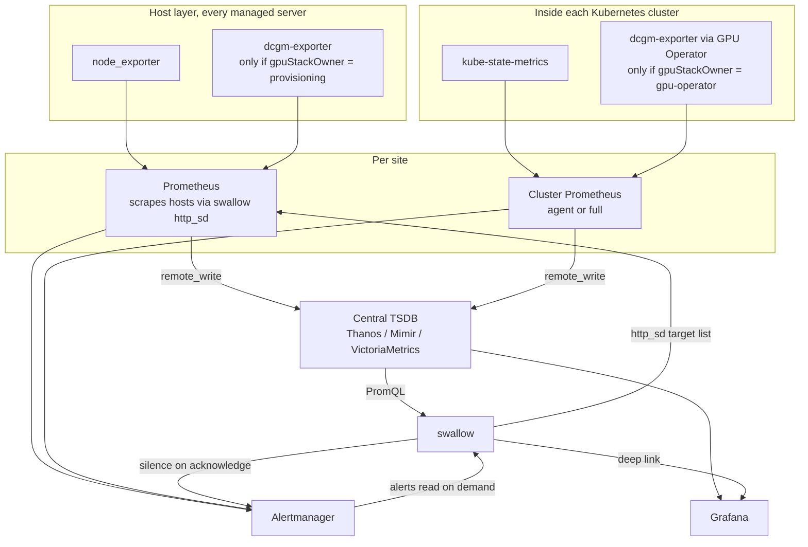

# 003 — Monitoring Topology and the Metrics Label Contract

## Decision

**One scraper per host, one Prometheus per site, one central store, and one label
contract that joins metrics back to swallow server identity.**

swallow serves the scrape target list itself, over Prometheus `http_sd`, attaching
`server_id`, `site`, and the labels below. This makes the join key impossible to get wrong,
because the identity mapping and the scrape configuration come from the same place.

Metrics produced inside a Kubernetes cluster are joined differently — by
`cluster` plus Kubernetes node name, resolved to a `server_id` by swallow at query time —
because swallow does not control an in-cluster scrape configuration.

Every cluster declares a `gpuStackOwner` policy that decides, once and explicitly, which
subsystem installs GPU drivers and the DCGM exporter.

## Context

Two problems, both real, both caused by having more than one thing that wants to monitor
a GPU host.

**Duplication.** A Kubernetes cluster installed with `kube-prometheus-stack` brings its
own Prometheus, `node-exporter` DaemonSet, `kube-state-metrics`, Grafana, and
Alertmanager. If the host layer also runs `node_exporter` and a bare-metal Prometheus,
the result is two exporters contending for port 9100 on the same host, two scrapers
collecting the same series, two alerting pipelines, and two Grafanas with divergent
dashboards. Worse, the NVIDIA GPU Operator manages both the driver *and* the DCGM
exporter inside the cluster, which collides directly with installing drivers during OS
provisioning.

**The join.** swallow's value is correlation, and correlation needs a key. A metric that
says `instance="10.0.1.10:9100"` cannot be attached to a server whose IP is an observed,
mutable, non-unique attribute ([002](002-server-identity.md)). Without a stable label
carrying swallow's `serverId`, every screen that wants "this server's temperature" has to guess.

## Topology

### Amendment: alerts are read, not received

This decision originally said alerts arrive by Alertmanager webhook. Implementation
showed that to be inconsistent with [001](001-system-ownership-boundaries.md): a webhook
receiver has to store what it receives in order to display it later, and that store is a
copy of state Alertmanager owns — exactly the kind of second home 001 forbids.

swallow therefore **reads** alerts from Alertmanager's API on demand and stores none.
Correlation to a server happens at query time from the label set. Acknowledging an alert
creates an Alertmanager silence, so the acknowledgement is visible to the alerting
pipeline itself rather than only inside swallow.

The cost is that swallow has no alert history: it can only show what Alertmanager currently
knows. That is the right trade for now — alert history is a reporting feature, and buying
it with a divergent copy of live state would be paying in the wrong currency.

The host layer exists independently of any cluster, because burn-in and acceptance
testing happen before a cluster does. A freshly provisioned GPU server has to be
observable while it is still a spare.

## The Label Contract

### Required labels

| Label | Value | Applied by |
|-------|-------|------------|
| `server_id` | swallow `serverId` | swallow `http_sd`, host-layer scrapes only |
| `site` | swallow `siteId` | swallow `http_sd`; static relabel for in-cluster Prometheus |
| `cluster` | swallow `clusterId` | Static relabel in the cluster's own Prometheus |

`server_id` and `site` are attached by swallow because swallow serves the target list. `cluster`
is attached by the cluster's Prometheus, which is the only thing that knows it is that
cluster.

### Two join paths, on purpose

**Host-layer metrics carry `server_id` directly.** swallow's `http_sd` endpoint returns
targets already labelled, so `node_exporter` and a provisioning-owned `dcgm-exporter`
are joinable with no lookup.

**In-cluster metrics carry `cluster` and the Kubernetes node name.** swallow does not own
the scrape configuration inside someone else's cluster and should not require editing it
beyond a `cluster` label. The `(cluster, kubernetes node name)` pair is resolved to a
`server_id` by swallow at query time, using the `membership` axis it already reads from the
Kubernetes API.

Requiring `server_id` inside cluster scrape configs was considered and rejected: it would
mean either swallow mutating a cluster's monitoring config, or an operator hand-maintaining
a mapping that drifts. Resolving at query time costs one lookup against data swallow
already has.

### Cardinality rules

- Do not add labels beyond this contract to identify a server. Rack, owner, GPU model, and
  tenant are swallow attributes, joined at query time, not metric labels. They change for
  reasons unrelated to the metric and would fragment series history on every change.
- `instance` stays whatever the scrape produces. It is a scrape detail, not an identity.
- A label added to metrics is effectively permanent. Adding one to this contract is a
  decision document, not a config change.

### How swallow queries

swallow exposes **named, parameterised queries** — "current utilisation for these servers",
"temperature history for this server" — not an arbitrary PromQL passthrough. Exploration is
Grafana's job and swallow deep-links to it.

A passthrough endpoint would make swallow responsible for query cost it cannot predict, let
a client trigger a fleet-wide high-cardinality scan through an authenticated API, and turn
every frontend change into a potential outage of the metrics backend. A fixed query set
is also what makes the two join paths above an implementation detail rather than
something every caller has to know.

## The `gpuStackOwner` Policy

Both provisioning and the GPU Operator want to own GPU drivers. Both are legitimate.
They cannot coexist on one host, so each cluster declares which one wins.

| Policy | Driver and DCGM installed by | Must be disabled |
|--------|------------------------------|------------------|
| `provisioning` | Manifest-listed embedded Ansible playbook after OS deployment; DCGM exporter runs on the host | GPU Operator's driver and DCGM components; `kube-prometheus-stack`'s `node-exporter` DaemonSet |
| `gpu-operator` | GPU Operator inside the cluster | Host-level driver installation and host `dcgm-exporter` for these servers |

Under either policy the host `node_exporter` stays, and `kube-prometheus-stack`'s
`node-exporter` DaemonSet is disabled: the host one is present before the cluster exists
and survives the cluster being rebuilt.

The trade-off is real in both directions. `provisioning` gives one driver version per
site under change control and works for servers not in any cluster, at the cost of
reprovisioning to change a driver. `gpu-operator` gives per-cluster driver versions and
in-cluster upgrades, at the cost of only working for servers that are cluster members and
of the driver's lifecycle being coupled to the cluster's.

swallow records the policy per cluster and refuses operations that contradict it — a driver
installation targeting servers in a `gpu-operator` cluster is rejected rather than executed.

## Consequences

- swallow implements a Prometheus `http_sd` endpoint serving host-layer targets with
  `server_id` and `site` attached, derived from the server projection.
- The same projection serves both the diagnostic dynamic-inventory endpoint and the embedded runner through one application use case ([006](006-embedded-ansible-execution.md)).
- swallow stores no metrics. The `GPUMetrics` and `GPUDevice` entities as storage concepts
  are dropped; GPU inventory comes from the provisioner and GPU telemetry from the TSDB.
- Alerts are read from Alertmanager on demand and correlated to servers by label;
  acknowledging is creating a silence in Alertmanager, not a field write in swallow.
- The frontend's synthesised metric data is removed rather than left as plausible-looking
  placeholder numbers.
- Which central store to operate — Thanos, Mimir, or VictoriaMetrics — is deliberately
  left open. All three satisfy this contract through `remote_write` and PromQL, so the
  choice can be made on operational grounds when the monitoring work starts, without
  changing anything decided here.

## Rejected Alternatives

**One Prometheus scraping the whole fleet.** One place to query, no federation, no
central store to operate. Rejected because it assumes flat network reachability from one
scraper to every host across every site, which a multi-site fleet does not have, and
because that scraper is then both a bottleneck and a single point of failure for all
monitoring.

**Classic Prometheus federation.** The established answer before `remote_write` matured.
Rejected because federation is lossy by design — it is intended for aggregates, and
pulling raw series through it reproduces the cardinality problem at the parent while
adding scrape-interval-dependent gaps.

**Let each cluster keep its own full monitoring stack, and have swallow query each one.**
Nothing to install, nothing to disable, every cluster self-contained. Rejected because a
fleet-wide question then fans out to every cluster, inheriting the slowest and failing
when any one is down; because servers outside a cluster have no home; and because a server
moved between clusters loses its history.

**Store a `server_id` label by writing it from provisioning into the node_exporter textfile
collector.** Puts the identity on the host where it cannot be lost. Rejected because it
makes every metric's identity depend on a file written once during provisioning, with no
correction path when it is wrong, and because `http_sd` achieves the same thing with the
mapping staying live.

**Arbitrary PromQL passthrough in swallow's API.** Maximum frontend flexibility with no
backend work per screen. Rejected: unbounded query cost through an API swallow is
responsible for, and it exports the two-join-path complexity to every caller.

## Related

- [001 — System Ownership Boundaries](001-system-ownership-boundaries.md)
- [002 — Server Identity](002-server-identity.md)
- [006 — Embedded Ansible execution](006-embedded-ansible-execution.md)
