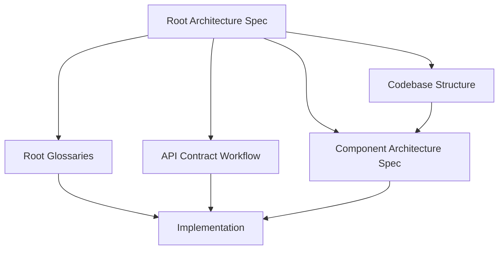

# Root Architecture Spec

本文件是 root project 的 architecture constitution，定義所有開發人員與 AI agent 在本 repository 內進行需求分析、設計、實作、重構與文件更新時必須遵守的 Strategic Domain-Driven Design 規範。

本文整理自 Eric Evans 的 [Domain-Driven Design Reference: Definitions and Pattern Summaries](https://www.domainlanguage.com/wp-content/uploads/2016/05/DDD_Reference_2015-03.pdf)。本文件定義全 swallow 共同規則；各 component（`api-server/`、`dashboard/`）可以有自己的 architecture spec，但不得違反本文件。

## 憲法層級

- Root spec 定義 repository-level architecture principles and constraints。
- Component spec 定義特定 bounded context 內的架構、分層、資料流、API contract 與實作限制。
- 當 root spec 與 component spec 都適用時，必須同時遵守；若有衝突，先停止並釐清，不得自行選擇性忽略。
- Root spec 不取代 component spec。進入任一 component 目錄前，必須依 root [`AGENTS.md`](../../AGENTS.md) 讀取該 component 的 `AGENTS.md`。
- 業務原始碼一律位於某個 component 目錄之內（`api-server/`、`dashboard/`）；因此 root spec 只規範跨 context 的語言、契約與邊界，不規範任何 component 的內部分層。

## Strategic DDD 核心原則

本專案採用 Strategic DDD 作為跨 component 的協作與演進原則：

1. 聚焦 Core Domain：優先辨識真正創造差異化價值的 domain，避免讓技術細節與 generic problem 淹沒核心。
2. 協作探索 Model：domain expert、developer 與 agent 必須透過需求、語言、文件、測試與程式碼共同演進 model。
3. 使用 Ubiquitous Language：每個 bounded context 內必須使用一致語言，並讓 glossary、文件、測試、API 與程式命名對齊。
4. 明確 Bounded Context：任何 model、術語或規則都只在特定 context 內成立；跨 context 必須明確翻譯。
5. 維護 Context Map：跨 component 或外部系統整合時，必須知道彼此關係、影響方向與翻譯方式。

## Glossary Workflow

任何涉及 implementation planning、code changes、implementation review、domain behavior、data models、cross-component integration 或 core flows 的工作，都必須依 [`docs/development/glossaries/README.md`](glossaries/README.md) 處理 glossary。

Root architecture spec 不重複定義 glossary lookup 或 authoring steps；詳細閱讀與修改流程以 glossary README 與 glossary spec 為準。

語言變更就是 model 變更。若程式碼命名與 glossary 不一致，應優先判斷是否需要更新 glossary、調整命名，或明確記錄同義詞與禁用詞。

## API Contract Workflow

任何建立、修改、消費或驗證 API 的工作，都必須依 [`docs/development/api-contracts.md`](api-contracts.md) 處理 API contract，再進行實作或整合。

API contract 是跨 bounded contexts 的 published language 與 shared boundary。Glossary 定義語言與 model；API contract 定義 provider 與 consumer 之間可依賴的路由、欄位、狀態碼、錯誤格式、認證授權與行為語意。

Root architecture spec 不重複定義 API contract steps；provider outline、active/planned contract 狀態與 provider/consumer rules 以 API contract workflow 文件為準。

禁止在 API contract 未確認前創造新的 API 行為、串接未文件化欄位、推測錯誤格式、依賴私有資料模型，或讓 consumer 直接追隨 provider 的 private implementation。

## Glossary 管理規範

Root-level domain glossary 必須集中在 [`docs/development/glossaries`](glossaries)。

每個 glossary term 必須至少描述：

- Bounded context：此定義適用的 context。
- Definition：名詞在該 context 內的精確意義。
- Allowed meaning：此 context 內可使用的語意。
- Disallowed meaning：容易混淆但不得使用的語意。
- Synonyms and deprecated terms：同義詞、舊稱、禁用詞。
- Examples：可幫助確認語意的情境或句子。
- Related terms：相關名詞與關係。
- Change note：新增或修改此定義的原因。

同一個詞可以出現在不同 bounded context，但必須分開定義，不得假設全 repository 只有單一語意。

## Bounded Context

Bounded context 是 model 適用的邊界，通常對應到 component、子系統、團隊責任、使用情境、資料邊界或整合邊界。

每個重要 component 或 domain area 必須能回答：

- 此 context 解決什麼 domain problem？
- 此 context 的 ubiquitous language 是什麼？
- 哪些名詞只在此 context 內成立？
- 此 context 與其他 context 的接觸點在哪裡？
- 哪些資料、事件、API 或文件會跨越 context？
- 此 context 的 component architecture spec 在哪裡？

在同一 bounded context 內，glossary、程式命名、測試案例、API 文件與討論用語必須保持一致。

注意：component 邊界是邏輯邊界，與 repository 是否單一無關。所有 component 同在一個
monorepo，並不代表可以共用彼此的內部 model；跨 component 一律透過 provider-owned API
contract 與共通 glossary 互動，component 邊界必須維持清楚。

## Context Map

當兩個 bounded contexts 有整合、資料交換、事件流、API 呼叫、共享模型或共同 release 風險時，必須建立或更新 context map 記錄。

Context map 的 root-level 預設位置是 `docs/development/context-maps/`。若 context map 只適用於單一 component，可放在該 component 的 `docs/development/context-maps/`，但 root 或 component spec 必須能指向它。

Context map 至少要描述：

- 參與的 contexts。
- 上游與下游關係。
- 接觸點：API、event、database integration、shared library、manual process。
- 翻譯方式：direct mapping、adapter、anticorruption layer、published language。
- API contract：若接觸點包含 API，必須引用或更新對應 contract，並確認 provider/consumer ownership。
- 共享或隔離機制。
- 變更影響：哪一方變更會影響另一方。

可使用以下關係模式描述 context 之間的策略：

- Partnership：雙方成敗綁定，必須共同規劃介面與 release。
- Shared Kernel：共享一小部分 model/code，必須保持範圍小且變更需協調。
- Customer/Supplier：上游需將下游需求納入規劃，最好以 acceptance tests 固化期待。
- Conformist：下游刻意接受上游 model，以降低整合成本。
- Anticorruption Layer：下游用隔離層保護自己的 model，不讓上游 model 污染內部語言。
- Open-host Service：上游提供穩定服務協定，讓多個下游使用。
- Published Language：跨 contexts 使用明確文件化的交換語言。
- Separate Ways：若整合價值低，應明確不整合，各自演進。
- Big Ball of Mud：若既有區域沒有清楚邊界，必須標記並隔離，不得假裝已有精準 model。

目前 swallow 的關係現況：`api-server` 是 open-host service（上游），對所有 client 發佈同一組協定；`dashboard` 是下游 consumer。跨 context 的 published language 是 `api-server` 所擁有的 API contract，不是任何一方的內部 model。下游必須明確表態採 conformist 或自建 anticorruption layer，並在該 component 的 architecture spec 中寫清楚。

## Distillation

大型系統會包含不同價值與不同變動率的 subdomains。開發時必須辨識並記錄：

- Core Domain：最能創造差異化價值、最需要深入建模與設計投入的部分。
- Supporting Subdomain：支撐 core domain，但不是主要差異化來源的部分。
- Generic Subdomain：必要但通用的問題，應考慮簡化、外購、套件化或隔離。

Core domain 必須保持小而清楚。若某項變更會影響 core domain 或 root glossary，必須提高審查強度，並同步更新 glossary、context map 或 component spec。

Generic subdomain 不應吸走 core domain 的設計注意力。若通用機制開始遮蔽 domain 語意，應分離到 supporting/generic area，並讓 core model 保持清晰。

## 共用實作與避免重複（Reuse-first）

跨 repository 的一致性不只靠命名與文件，也靠「同一行為只有單一實作來源」。此原則對所有 component 適用（Go 與 TypeScript 皆然），並優先於「先做出功能」的短期便利。

- Single source of truth：同一個 domain 行為、資料轉換或 UI 呈現，必須有單一 canonical 實作（function、type、component）。需要它的地方以組合/引用方式使用，不得複製一份。
- 擴充既有共用實作：為共用功能新增欄位、狀態或子區塊時，必須修改該共用實作，讓所有 consumer 一致受益；不得只改其中一個呼叫點，造成同功能在不同位置行為分歧。
- 禁止散落複製：不得跨頁面、跨模組或跨 component 複製已組合的邏輯或 UI 區塊。若差異存在，應以參數/props/組合注入差異，而不是分叉出第二份實作。
- 差異最小化與定位：共用元件保留穩定核心，差異透過明確的參數表達，並讓「哪裡不同、為何不同」在型別或註解中清楚可見。
- 重構優先於再寫一份：發現重複時，優先抽出共用實作並讓既有呼叫點改用之，而不是為了趕工再貼一份。若因時間壓力暫時無法共用，必須在文件或 TODO 中明確記錄，不得默默留下重複。

細部規範（例如 dashboard 的 UI 元件共用與組合方式）由對應 component 的 architecture spec 或 coding style 定義；本原則是它們必須遵守的上位規則。

## 禁止重複定義概念

本 repository 的價值在於「跨 component 的單一事實來源」，因此以下行為視為違規：

- 在 component 內重新定義已存在於 root glossary 的術語，或給它不同語意而不更新 glossary。
- 在 consumer 端自行推測、複製或分叉 provider 的 API 行為，而不是引用 provider-owned contract。
- 從其他專案、舊產品或 framework 詞彙帶入本專案文件未定義的概念。
- 為了共用方便，把跨 context 資料結構塞進 `common`、`util`、`shared` 等語意模糊的位置。

新增概念前必須先確認：glossary 是否已有、API contract 是否已定義、程式碼中是否已存在。能延伸就延伸，不新增平行概念。

## Large-scale Structure

Root spec 提供跨 repository 的大尺度結構：

這個結構只定義必要秩序，不應限制 component 做出符合自身 bounded context 的細部設計。當專案理解變深時，root spec、glossary、API contract workflow 與 component spec 都可以演進，但必須在文件中留下清楚語意。

## Component Spec Discovery

修改任一 component 前，必須依 root [`AGENTS.md`](../../AGENTS.md) 先讀取該 component 的 `AGENTS.md`。Component-local `AGENTS.md` 會用相對路徑列出該 component 的 architecture spec、coding style、API contract outline 或其他必讀文件。

各 component 採用 **完整 Clean Architecture** 作為內部架構原則；細節由該 component 的 architecture spec 定義：

- `api-server` — [`api-server/docs/development/architecture-spec.md`](../../api-server/docs/development/architecture-spec.md)
- `dashboard` — [`dashboard/docs/development/architecture-spec.md`](../../dashboard/docs/development/architecture-spec.md)

若 component-local `AGENTS.md` 不存在，才依下列路徑尋找 architecture spec，並將缺漏視為需要補齊的 component 入口問題：

- `<component>/docs/development/architecture-spec.md`
- `<component>/docs/architecture-spec.md`

若 component spec 不存在：

- 若本次工作涉及 architecture、domain model、API contract、資料模型、跨 context 整合或核心流程，必須先停下並補齊 spec 或詢問負責人。
- 若只是明確的非 domain 小修，仍必須遵守 root spec 與 glossary workflow，並在必要時補文件。

## 開發前檢查清單

開始任何開發工作前，開發人員與 agent 必須完成：

- 已讀取 root [`AGENTS.md`](../../AGENTS.md)。
- 已讀取 [`codebase-structure.md`](codebase-structure.md)，並辨識本次工作所屬的 component。
- 已讀取本文件。
- 已辨識本次工作所屬 bounded context。
- 已依 root `AGENTS.md` 判斷是否需要讀取 glossary、API contract workflow、commit spec 或 component `AGENTS.md`。
- 已確認是否需要更新 context map、API contract、資料模型或測試策略。

## Agent 執行規則

AI agent 執行任務時必須遵守：

- 符合 glossary workflow 條件時，不得跳過 [`docs/development/glossaries/README.md`](glossaries/README.md)。
- 符合 API contract workflow 條件時，不得跳過 [`docs/development/api-contracts.md`](api-contracts.md)。
- 不得在未確認 bounded context 前創造新的 domain term、type、API、event 或資料欄位。
- 若發現 glossary 缺漏或衝突，必須先更新 glossary 或詢問使用者，不得直接猜測。
- 不得創造未文件化的 API route、request field、response field、status code、error format、auth/authz 規則或行為語意。
- 若發現 API contract 缺漏、過期或模糊，必須依 API contract workflow 更新 contract 或詢問使用者，不得依賴 provider/consumer 的 private implementation。
- 若工作跨越 contexts，必須說明 context map 影響與翻譯策略。
- 若進入某個 component，必須先讀取該 component 的 `AGENTS.md`；若不存在且任務涉及架構或 domain，必須停下並要求補齊或取得確認。
- 修改程式碼時，命名必須符合 glossary 與該 context 的 ubiquitous language。
- 完成 domain 行為或 API 行為變更時，必須檢查 glossary、API contract、component spec、測試與文件是否需要同步更新。
