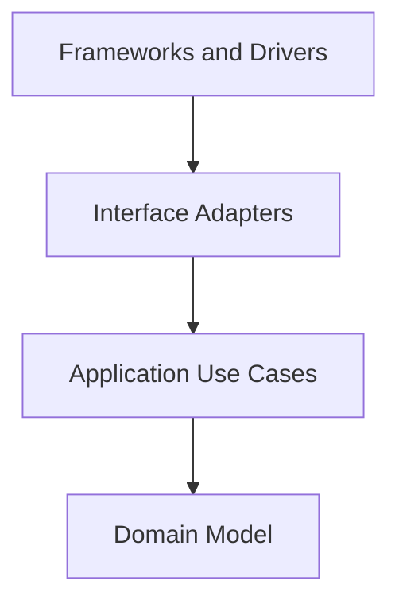

# Dashboard Architecture Spec

本文件定義本 project 的架構開發原則，適用於所有開發人員與 AI agent。

本 project 採用 Clean Architecture 作為主要架構原則。實作時必須讓 dashboard 的 domain model 與 application use cases 獨立於 React、Vite、browser API、router、storage、API client、UI 元件庫與部署細節。

本文整理自 [The Clean Architecture](https://blog.cleancoder.com/uncle-bob/2012/08/13/the-clean-architecture.html)，並搭配 TypeScript + React 規範 [`coding-style.md`](coding-style.md) 使用。

## 核心目標

本 project 的設計必須滿足以下目標：

- Separation of concerns：UI 呈現、使用者互動、application flow、domain rule、API mapping 與 framework wiring 必須分開。
- Independent of frameworks：React、Vite、router 與 Mantine 是工具，不是核心規則的中心。
- Testable：domain model 與 use case 必須能在不啟動 browser、不 render React、不呼叫外部 API 的情況下測試。
- Independent of UI details：畫面佈局、component library、CSS、route 結構與瀏覽器事件不得影響內層規則。
- Independent of external agencies：內層邏輯不應知道 HTTP client、`localStorage`、`URLSearchParams`、第三方 SDK 或後端 response shape 的細節。

## Dependency Rule

Clean Architecture 最重要的規則是 Dependency Rule：source code dependencies 只能指向內層。



依賴方向代表：

- 外層可以知道內層。
- 內層不得 import、引用、命名或依賴外層。
- Domain model 與 application use case 不得 import React、React DOM、Vite、CSS、Mantine、router、API client 或任何 browser API wrapper。
- 內層不得接受外層 framework 的資料型別，例如 `MouseEvent`、`Response`、`URLSearchParams`、route params object、storage record、API response DTO、第三方 SDK object。
- 外層變更不應迫使內層 domain rule 或 use case contract 變更。

TypeScript 沒有編譯期的分層強制：`import` 可以跨越任何邊界。因此這條規則靠 import 紀律與 review 維持。`@/*` alias 讓違規在 review 中一眼可見——看 import 路徑的第一段，就能判斷方向對不對。

若流程控制需要由內層觸發外層能力，必須使用依賴反轉：內層定義需要的 port/interface，外層提供實作。

## 建議層次

實際目錄名稱可依專案演進調整，但責任邊界必須清楚。

### Domain Model

Domain model 是最內層，位於 `src/domain/<concept>/`，負責 dashboard 需要表達的核心概念與穩定規則。

Domain model 可以包含：

- Domain type、value object、entity-like data structure。
- 狀態值集（例如 `ServerStatus`）與其允許的轉換。
- 不依賴 UI、browser 或外部 API 即可執行的規則。
- 與平台 glossary 對齊的 ubiquitous language。

Domain model 不得包含：

- React component、hook、JSX、CSS class name。
- API response shape、HTTP status code、fetch client 型別。
- Browser event、route object、storage key、DOM API。
- Mantine props、theme token 或 framework lifecycle。

### Application Use Cases

Application use cases 位於 `src/application/`，描述 dashboard 特定的使用者目標與應用流程，負責協調 domain model 與 ports。

Use cases 可以包含：

- `usecases/<area>/<Name>UseCase.ts`：一個 use case 一個類別、一個 `execute`。
- `ports/<Name>Repository.ts`：repository、clock、storage、notification 等 port/interface 定義。
- `dtos/`：use case 對外交付的形狀。
- Loading、empty、error、success 等可測試的 application state transition。

Use cases 不得包含：

- JSX、React hook、component state setter。
- 具體 HTTP client、browser storage、router implementation 或 Mantine 呼叫。
- CSS、DOM 操作或 layout decision。
- 後端原始 response shape 或傳輸協定細節。

### Interface Adapters

Interface adapters 負責轉換內層與外層之間的資料格式。

Interface adapters 可以包含：

- `src/infrastructure/api/`：真實 HTTP adapter 與 transport 型別（`types.ts`），以及 DTO 到 domain 的 mapper。
- `src/infrastructure/mock/`：in-memory repository 與 seed data，實作同一組 port。
- `src/infrastructure/persistence/`：browser storage adapter。
- Presenter、view model mapper、form mapper。
- Custom hook 作為 React 與 use case 之間的 adapter，但 hook 不應承載核心規則。

Interface adapters 必須避免把外層格式直接傳入 use case 或 domain model。

### Frameworks and Drivers

Frameworks and drivers 是最外層，負責具體工具與執行環境。

這一層可以包含：

- `src/main.tsx`：React root 與 Vite bootstrap。
- `src/router.tsx`：route table 與 route guard wiring。
- `src/di/`：composition root（`container.ts` 組裝 adapter 與 use case，`AppProvider.tsx` 把容器發佈給 React tree）。
- `src/presentation/app/`：app shell（layout、theme、i18n）。
- Browser API、storage、network client、timer。
- Environment variable、build-time config。

外層程式碼應保持薄，主要負責 wiring、configuration、rendering 與 glue code。

## 專案目錄對應

```text
src/
├── domain/<concept>/types.ts          # 內層：entity、value type、狀態值集
├── application/
│   ├── ports/<Name>Repository.ts      # 內層擁有的抽象
│   ├── usecases/<area>/<Name>UseCase.ts
│   └── dtos/                          # use case 對外交付的形狀
├── infrastructure/
│   ├── api/                           # 外層：真實 HTTP adapter + transport 型別
│   ├── mock/                          # 外層：in-memory adapter + seed data
│   └── persistence/                   # 外層：browser storage driver
├── presentation/
│   ├── app/                           # shell：layout、theme、i18n
│   ├── pages/<area>/                  # routed screens
│   ├── components/                    # 可重用呈現元件
│   └── contexts/                      # 跨畫面 React state
├── di/                                # composition root：container + provider
├── shared/                            # 無框架依賴的 helper，不屬於任何層
├── router.tsx                         # route table
└── main.tsx                           # entry point
```

目錄規則：

- `domain/` 不得 import `application/`、`infrastructure/`、`presentation/`、`di/`，也不得 import 任何 npm framework/UI/HTTP 套件。
- `application/` 可 import `domain/` 與自己的 `ports/`，不得 import `infrastructure/`、`presentation/` 或 `di/`。
- `infrastructure/` 可 import `application/` 與 `domain/`，負責格式轉換與 port 實作。
- `presentation/` 可 import use case、view model 與 domain type，**不得 import `infrastructure/`**，也不得把 React 型別傳入內層。
- `di/` 可知道所有外層工具，並在 composition root 完成 wiring。
- `shared/` 是無層級的 helper：任何層都可以 import 它，它不得 import 任何層。

新增功能的順序因此固定為：domain type → port（若需要新資料）→ use case → 實作 port 的 adapter → 在 `di/container.ts` 註冊 → 最後才是畫面。

## 資料穿越邊界

跨層傳遞資料時，資料格式必須以內層最容易理解與維護的形式為準。

- 進入 use case 前，API response、route params、query string、browser event、form value、storage value 必須先轉成內層 input model 或簡單 value。
- Use case 回傳給 UI 時，應回傳 domain 型別或 application result model，再由 presenter/mapper 轉成 view model。
- 不得把 `Response`、API DTO、DOM event、router object、storage record 或第三方 SDK response 傳入 domain/use case。
- 後端 response 形狀留在 `infrastructure/api/types.ts`；它必須在抵達 use case 前被 map 成 domain 型別，component 永遠不會收到 transport DTO。
- 跨邊界資料應使用清楚、穩定、低耦合的 interface、primitive value、readonly data structure 或明確 domain type。

```ts
// Good: use case receives an input model defined for the application rule.
interface ListServersInput {
  readonly status?: ServerStatus
  readonly keyword?: string
}

// Bad: use case depends on browser and routing details.
function listServers(searchParams: URLSearchParams): Promise<void>
```

API DTO 與 domain model 不應共用同一個 type，除非該 type 已被明確定義為穩定的 published language，且文件說明其跨邊界語意。

## Ports 與依賴反轉

Interface 是用來保護內層規則，不是用來裝飾每個物件。

- Port/interface 由使用端定義，描述 use case 真正需要的能力，並以 domain 語彙表達、回傳 domain 型別。
- Port 應保持小而明確，避免把 fetch client、router、storage 或 SDK 的完整 API 洩漏進內層。
- 外層 adapter 實作內層定義的 port，並以它包裝的 driver 命名（`RealServerRepository`、`MockServerRepository`）。
- 不為了「未來可能替換」建立空泛 abstraction；只有在跨邊界、測試隔離或依賴反轉需要時才引入。

```ts
// Good: the use case owns the data need.
interface ServerRepository {
  listServers(filters?: ListServersFilters): Promise<Server[]>
  getServer(id: string): Promise<Server | null>
}
```

Use case 透過建構參數取得 port——不 import 實作、不使用 module-level singleton。`src/di/container.ts` 是唯一決定「用真實 API 還是 mock」的地方；把 mock 換成真實 backend 只改這一個檔案。

## React 的位置

React component 屬於 interface adapter 或 framework detail，不是 domain model 或 use case。

- Page component 負責組合 hooks、view model 與呈現元件。
- Presentational component 負責渲染 props，不執行 application use case。
- Custom hook 可以作為 React 與 use case 的 adapter，負責呼叫 use case、管理 UI lifecycle、把結果轉成 component state。
- Hook 內若出現核心規則、複雜資料轉換或可獨立測試的流程，應抽到 application/domain 層。
- `useEffect` 只處理同步外部世界的副作用；domain rule 不應依賴 effect 才能成立。
- Component 透過 `AppProvider`/context 從容器取得 use case。在 `src/presentation/**` 內 import `@/infrastructure/**` 是架構違規。

## 錯誤與狀態邊界

- Use case 應回傳具有 application/domain 語意的 error 或 result，不暴露 HTTP status、fetch error 或 browser exception 作為核心契約。
- `infrastructure` 負責把 transport 失敗轉成 domain 有意義的錯誤；use case 不該看到 status code，presentation 也不該靠解析錯誤字串決定畫面。
- UI 可以把 application error 轉成使用者可讀訊息，但不得讓文案或 component 狀態成為 use case 規則。
- Loading、empty、error、success state 應在 use case result 或 view model 中清楚表達，避免用多個可互相矛盾的 boolean 暗示狀態。優先使用單一 discriminated union。

## 測試要求

- Domain model 必須能用純 unit test 驗證，不需要 React、browser、network 或 mock framework。
- Use cases 必須能以 fake port implementation 測試，不需要啟動 Vite、render React component 或呼叫真實 API。
- Interface adapters 應測試 DTO mapping、view model mapping、錯誤映射與 port implementation。
- UI component 測試應聚焦使用者可觀察行為、accessibility role、互動結果與狀態呈現。
- Frameworks and drivers 測試應集中在 wiring 與 integration，不應重測內層規則。
- 若某段 dashboard 邏輯難以測試，通常代表依賴方向或責任邊界需要調整。

> 現況：本 project 尚未接入 unit test runner（`playwright` 已安裝但沒有 script）。在補上之前，仍必須維持「可測性」：use case 與 domain 邏輯必須能只靠 stub port 執行。`src/infrastructure/mock/` 的 mock repository 能完整替代後端，正是這個架構要保證的性質。

## 禁止事項

以下做法違反本 project 的 Clean Architecture 原則：

- Domain model 或 use case import React、React DOM、Vite、router、CSS、Mantine、browser API、API client 或 storage implementation。
- Use case 直接呼叫 `fetch`、讀寫 `localStorage`、操作 `window.location`、建立 `URLSearchParams` 或處理 DOM event。
- `src/presentation/**` import `@/infrastructure/**`。
- 內層函式接受 API response DTO、browser event、route params object、storage record 或第三方 SDK response。
- 在 domain type 放入只服務 UI library、CSS、route、API response 或 browser storage 的欄位。
- 為了共用方便，把跨層資料結構放到 `common`、`utils`、`models` 等模糊目錄，導致依賴方向不明。
- 讓 HTTP status、API error shape、URL query string 或 component prop shape 成為 domain rule 的一部分。
- 在 component、router 或 adapter 內實作業務規則（決定「什麼可以發生」的規則屬於 domain 或 use case）。
- 在 use case 或 component 內分支判斷「現在用的是 mock 還是真實 API」。
- 因為測試困難而跳過測試，而不是修正架構邊界。

## Agent 執行規則

AI agent 新增或修改本 project 程式碼時必須遵守以下規則：

- 修改前先判斷目標程式碼屬於 domain model、application use case、interface adapter 或 framework/driver。
- 新增 import 時檢查依賴方向；內層不得 import 外層。
- 新增跨層資料傳遞時，確認資料格式由內層定義或對內層友善。
- 新增 React component、route、storage、browser API、HTTP client 或第三方 SDK 整合時，只能放在外層，並透過 adapter 或 port 連接內層。
- 修改 use case 或 domain model 時，必須保持不需要 render React component 或呼叫外部 API 即可測試。
- 若需要新增 interface，先確認它是否由 use case 需求驅動，而不是為了包裝具體實作。
- 串接後端 API 前，必須以 provider 擁有的 API contract 為準，不得從後端實作推測行為。
- 修改 architecture contract、資料邊界或依賴方向時，必須同步更新文件與測試。
- 必須遵守 [`coding-style.md`](coding-style.md) 的 TypeScript、React、註解、可存取性與測試規範。
