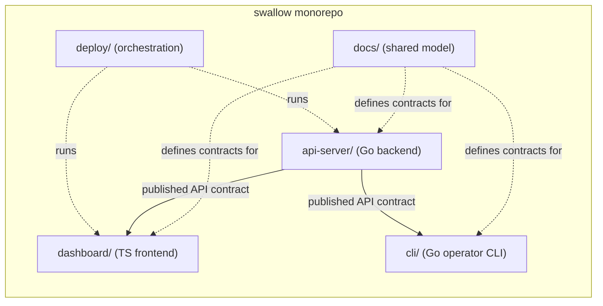

# Codebase Structure

本文件定義 swallow monorepo 中 component 與目錄結構的用途與關係，適用於所有開發人員與 AI agent。

本 repository 是 swallow 這個系統的 **monorepo**：所有 source code 以頂層目錄 (top-level
directory) 依 component 分門別類，直接放在 repository 內，不再使用 git
submodule。每個 component 目錄就是該 component 的 code entry point。

本文件是這個 repository 的**結構契約 (structure contract)**。以下情境必須先閱讀本檔：

- 新增、移除或重命名 component。
- 調整頂層目錄結構。
- 在 `docs/` 中新增跨 component 共用的定義文件。

本檔不描述任何 component 內部的實作細節，那些屬於各 component 自己的 architecture spec 與文件。

## Components

Repository 以頂層目錄承載每個 component，目錄名即 component 的角色名稱。開發
人員與 agent 尋找程式碼時，先判斷 component，再進入對應目錄。

目前 component 對應如下：

- `api-server` — 目錄 `api-server/`。Data Center API Service：平台後端 HTTP API 與背景
  reconcile / poll 迴圈，是平台唯一的 API-owning component。以 Go module
  `github.com/maple52046/swallow` 建置，binary 為 `swallow-api`。
- `dashboard` — 目錄 `dashboard/`。前端 dashboard：React + TypeScript + Vite。
- `cli` — 目錄 `cli/`。Operator CLI：命令列客戶端，是 `api-server` HTTP API 的 consumer
  （與 `dashboard` 同級）。以獨立 Go module `github.com/maple52046/swallow/cli` 建置，
  binary 為 `swallow`。

> Note：`swallow` 與 `swallow-api` 是 **binary 名稱**，不是 component 目錄名。頂層目錄名
> 一律以 component 角色命名（`api-server/`、`cli/`），binary 由對應 component 建置產生。

每個 component 目錄是一個獨立的 build / test 單位（`api-server` 為 Go module，
`dashboard` 為 npm project），並帶有自己的 `AGENTS.md`、`docs/` 與 coding style。

> Note：早期設計曾規劃節點端 `agent` component，並以 `src/<project>` git submodule 搭配
> root component symlink 承載程式碼。`agent` 已依
> [ADR-001](../decisions/001-system-ownership-boundaries.md) 退場（node control 交由
> Swallow embedded Ansible execution），submodule 架構亦已依
> [ADR-005](../decisions/005-monorepo-consolidation.md) 收斂為本 monorepo。若在舊文件或
> 討論中看到 `src/swallow`、`src/dashboard` 或 component symlink，一律以本檔為準。

## Repository Layout

```text
.
├── api-server/     # Go backend (component)
├── dashboard/      # TypeScript frontend (component)
├── cli/            # Go operator CLI (component)
├── deploy/         # dev/testing/production、release 與 third-party installation assets
├── docs/           # swallow 共通約束文件（shared model）
├── skills/         # 任務導向操作指南
├── AGENTS.md       # AI agent 入口導引
└── .cursor/        # Cursor rules / hooks / skills
```

## Component 與目錄對應關係



## Code Lookup Workflow

開發人員與 agent 尋找程式碼時，必須先判斷 component，再進入實際入口：

1. 先判斷需求涉及哪個 component，例如 `api-server` 或 `dashboard`。
2. 進入對應頂層目錄。
3. 回到 root [`AGENTS.md`](../../AGENTS.md) 的任務導引，讀取該 component 的 `AGENTS.md`，
   再依其 project-local 規範定位實作。

只有在任務本身是 repository 層級（跨 component tooling、`deploy/` 環境編排、`docs/` 共通
文件）時，才從 root 或這些共用目錄開始。

## Docs Layout

`docs/` 只保存跨 component 共通的**定義性文件 (definitional documents)**；各 component 的
內部設計文件留在自己的目錄中（例如 `api-server/docs/`、`dashboard/docs/`）。

- [`docs/development/`](.) — 平台層級的開發規範：
  - [`architecture-spec.md`](architecture-spec.md) — Strategic DDD architecture constitution。
  - [`codebase-structure.md`](codebase-structure.md) — 本檔，結構契約。
  - [`api-contracts.md`](api-contracts.md) — API contract 的 provider-first discovery workflow。
  - [`platform-deployment.md`](platform-deployment.md) — platform deployment 的設計、開發與整合規範（Workflow/Job/Task/Runner；新增 platform = 交一支 playbook）。
  - [`commit-spec.md`](commit-spec.md) — commit message 規範。
  - [`glossaries/`](glossaries) — 跨 component 共通的 domain glossary，定義平台的 ubiquitous language。
  - `context-maps/` — 跨 context 的 context map（依需要建立）。
- [`docs/decisions/`](../decisions) — 輕量 ADR，記錄影響面廣的架構決策。
- `docs/plans/` — 歷史計畫紀錄；`docs/plans/manuscripts/` 為進行中的計畫草稿。

每個類別目錄內的文件應遵循相同風格：採結構化段落，描述 swallow 範圍內的共識，不描述某個
component 的內部實作細節。

## Rules

- 日常程式碼查找與需求分析必須先辨識 component。
- 每個 component 以頂層目錄承載，目錄名即 component 的角色名稱。
- component 邊界是**邏輯邊界**：即使同在一個 repo，也不得跨 component 直接耦合對方的內部
  實作；跨 component 只透過 provider-owned API contract 與 `docs/` 的共通定義互動。
- 業務原始碼一律位於某個 component 目錄之內；repository root 只放跨 component 的 `docs/`、
  `deploy/`、`skills/` 與 `.cursor/` harness。
- `docs/` 內**只**保存跨 component 共通的契約與定義。

## Operating Conventions

### Clone

單一 repository，無 submodule：

```bash
git clone <repo-url>
```

### 新增一個 Component

1. 在 repository root 建立頂層目錄 `<component-name>/`，放入該 component 的 source 與
   `AGENTS.md`（以及該 component 的 `docs/` 與 coding style）。
2. 在本檔的 [Components](#components) 章節登錄該 component。
3. 若該 component 提供 API，於 [`api-contracts.md`](api-contracts.md) 的 provider 表格登錄，
   並在該 component 內建立 provider-owned contract。
4. 若該 component 引入新的共通概念，於 [`glossaries/`](glossaries) 增補對應 term，並更新
   glossary outline。
5. 於 [`deploy/`](../../deploy) 增補該 component 的執行或安裝方式（如需要）。

### 移除或重命名 Component

- 同步更新頂層目錄、本檔的 [Components](#components) 章節，以及
  [`deploy/`](../../deploy) 中的環境編排。
- 若該 component 曾被 glossary、context map 或 API contract 引用，須一併更新相關文件，以
  避免共通契約與實作脫節。

## Out of Scope

下列項目**不**在本檔範圍內，由各 component 自行維護：

- 各 component 的內部模組結構與分層細節（見各 component 的 architecture spec）。
- 各 component 的 build、run、installation 指令。
- 各 component 的 CI/CD pipeline。
- 各 component 的依賴版本與套件管理策略。
