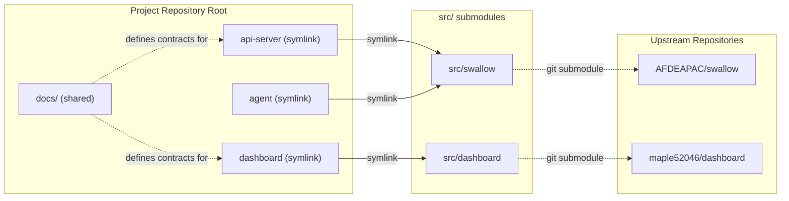

# Codebase Structure

本文件定義 root codebase 中 platform component、root component symlink 與 `src/` source project 的用途與關係，適用於所有開發人員與 AI agent。

本 repository 以 platform component 作為日常開發與討論邊界，但實際 source code project 放在 `src/` 目錄中，並以 git submodule 管理。Repository root 以 component 名稱建立 symlink，指向對應的 source project，讓路徑語意貼近領域而非 repo 命名。

本文件是這個 repository 的**結構契約 (structure contract)**。以下情境必須先閱讀本檔：

- 新增、移除或重命名 component。
- 調整 `src/` 或 root 目錄結構。
- 在 `docs/` 中新增跨 sub-project 共用的定義文件。

本檔不描述任何 sub project 內部的實作細節，那些屬於各 sub project 自己的 architecture spec 與文件。

## Component Alias（root symlink）

Repository root 的 component symlink 是開發人員與 agent 尋找程式碼時的建議入口。

這些 symlink 以 platform component 命名，反映需求、討論與工作指派時常用的 component 邊界。即使多個 component 指向同一個 source project，也應先從 component 名稱開始定位。

目前 component 對應如下：

| Component | Source project | Purpose |
| --- | --- | --- |
| `api-server` | `src/swallow` | Data Center API Service：平台後端 HTTP API 的 code entry point。 |
| `agent` | `src/swallow` | Compute Agent：節點端 agent runtime 的 code entry point。 |
| `dashboard` | `src/dashboard` | 前端 dashboard source project entry point。 |

一個 source project **可以**對應多個 component symlink。`api-server` 與 `agent` 共用 `src/swallow`，但兩者是不同的 platform component，責任邊界必須維持清楚。

## `src/`

`src/` 是 platform 的 source code project 存放位置。

此目錄下的 project 使用 git submodule 管理，是實際程式碼與 project-local files 的物理位置。`src/` 內**只能**存放 git submodule，不得直接放未受版控的原始碼或工作目錄。

目前 source projects 包含：

- `src/swallow` — upstream `git@github.com:AFDEAPAC/swallow.git`
- `src/dashboard` — upstream `git@github.com:maple52046/dashboard.git`

完整 submodule 設定見 [`.gitmodules`](../../.gitmodules)。

## Component 與 Submodule 對應關係



## Code Lookup Workflow

開發人員與 agent 尋找程式碼時，必須先判斷 component，再進入實際入口：

1. 先判斷需求涉及哪個 platform component，例如 `api-server`、`agent` 或 `dashboard`。
2. 從 root 的 component symlink 進入對應 component。
3. 若 symlink 不存在，依上方 mapping 直接進入對應 `src/<project>`。
4. 回到 root [`AGENTS.md`](../../AGENTS.md) 的任務導引，讀取對應 source project 的 `AGENTS.md`，再依其 project-local 規範定位實作。

只有在任務本身是 source project 層級，例如 submodule 管理、project-wide tooling 或 shared implementation 結構時，才直接從 `src/<project>` 開始。

## Docs Layout

`docs/` 只保存跨 sub-project 共通的**定義性文件 (definitional documents)**；各 sub project 的內部設計文件留在自己的 submodule 中。

- [`docs/development/`](.) — 平台層級的開發規範：
  - [`architecture-spec.md`](architecture-spec.md) — Strategic DDD architecture constitution。
  - [`codebase-structure.md`](codebase-structure.md) — 本檔，結構契約。
  - [`api-contracts.md`](api-contracts.md) — API contract 的 provider-first discovery workflow。
  - [`commit-spec.md`](commit-spec.md) — commit message 規範。
  - [`glossaries/`](glossaries) — 跨 sub-project 共通的 domain glossary，定義平台的 ubiquitous language。
  - `context-maps/` — 跨 context 的 context map（依需要建立）。
- [`docs/decisions/`](../decisions) — 輕量 ADR，記錄影響面廣的架構決策。
- `docs/plans/` — 歷史計畫紀錄；`docs/plans/manuscripts/` 為進行中的計畫草稿。

每個類別目錄內的文件應遵循相同風格：採結構化段落，描述 project 範圍內的共識，不描述某個 sub project 的內部實作細節。

## Rules

- 日常程式碼查找與需求分析必須先辨識 platform component。
- 每個 component 在 repository root **必須**以 symlink 暴露其 component 名稱，例如 `api-server -> src/swallow`。
- `src/` 內**只能**存放 git submodule；實際 source project 與 project-local files 位於 `src/<project>`。
- 不要因為多個 components 指向同一個 source project，就忽略 component 邊界。
- 不在 repository root 直接放任何業務原始碼；所有實作必須位於 `src/<project>` 之內。
- `docs/` 內**只**保存跨 sub-project 共通的契約與定義。

## Operating Conventions

### Clone / Sync

- 初次 clone project：

  ```bash
  git clone --recurse-submodules <project-repo-url>
  ```

- 既有 clone 補拉 submodule：

  ```bash
  git submodule update --init --recursive
  ```

- 同步 submodule 至各自 upstream 最新版本：

  ```bash
  git submodule update --remote
  ```

### 新增一個 Component

1. 將 upstream repo 加為 submodule（若該 component 屬於既有 source project，跳過此步）：

   ```bash
   git submodule add <upstream-url> src/<repo-name>
   ```

2. 在 repository root 建立 symlink，使用 component 的角色名稱：

   ```bash
   ln -s src/<repo-name> <component-name>
   ```

3. 在本檔的 [Component Alias](#component-aliasroot-symlink) 章節登錄該 component。
4. 若該 component 提供 API，於 [`api-contracts.md`](api-contracts.md) 的 provider 表格登錄，並在該 source project 建立 provider-owned contract。
5. 若該 component 引入新的共通概念，於 [`glossaries/`](glossaries) 增補對應 term，並更新 glossary outline。

### 移除或重命名 Component

- 同步移除/更新 symlink、[`.gitmodules`](../../.gitmodules) 中的 submodule 條目，以及本檔的 Component Alias 章節。
- 若該 component 曾被 glossary、context map 或 API contract 引用，須一併更新相關文件，以避免共通契約與實作脫節。

## Out of Scope

下列項目**不**在本檔範圍內，由各 sub project 自行維護：

- 各 sub project 的內部模組結構與分層細節（見各 project 的 architecture spec）。
- 各 sub project 的 build、run、deploy 指令。
- 各 sub project 的 CI/CD pipeline。
- 各 sub project 的依賴版本與套件管理策略。
