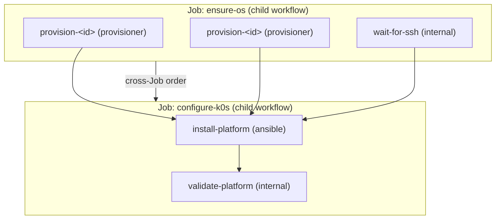

# Platform Deployment 設計、開發與規範

本文件為 swallow **platform deployment** 的權威設計文件（design）、開發指引（development
guide）與整合規範（standards）。它把
[decision 016](../decisions/016-temporal-operation-orchestration.md)、
[decision 017](../decisions/017-workflow-job-task-runner-model.md)、
[decision 006](../decisions/006-embedded-ansible-execution.md) 以及 root glossary 的
Workflow / Job / Task / Runner 語言，落成「swallow 如何佈署一個 platform」與「如何整合一個
新的 platform」的具體設計與規範。

> **本文件的定位（定調）**：以 **k0s (Kubernetes)** 作為 reference implementation，確立
> platform deployment 的骨架與**整合契約 (integration contract)**。未來整合其他 platform
> （例如 **Slurm**、storage），原則是**交付一支 idempotent 的 Ansible playbook、遵守 inventory
> 與 trusted-vars 契約、並在 manifest 註冊**；OS 佈署、SSH 就緒、credential 記錄等骨架由
> swallow 提供並重用，不必為每個 platform 重寫。

## 讀者與使用方式

- **開發者**：理解 deployment pipeline、擴充或除錯 orchestration、撰寫新的 platform playbook。
- **AI agent（同等重要）**：本文件是理解 deployment 設計的入口。涉及 platform deployment 的
  orchestration、Runner、inventory/trusted-vars 契約，或「新增一個 platform」的任務時，必須
  先讀本檔，再進入 `api-server` 依其 `AGENTS.md` 定位實作。

本文件**不重述** ADR 與 glossary，只做 elaboration；語言以 root glossary 為準，決策理由以
ADR 為準。實作細節（Clean Architecture 分層、Go coding style）由
[`api-server`](../../api-server/AGENTS.md) 的文件負責，本檔只指出「設計」與「契約」，並在
§7 提供程式位置對照供導航。

---

## 1. 心智模型：Workflow → Job → Task → Runner

deployment 一律以這四層表達（完整定義見 glossary：
[Workflow](glossaries/terms/workflow.md)、[Job](glossaries/terms/job.md)、
[Task](glossaries/terms/task.md)、[Runner](glossaries/terms/runner.md)）：

- **Workflow** — operator 的意圖，表達為「一組 resource 的 desired end-state」（例如「這 7 台
  Server 是一個帶這些角色的 k0s Platform」）。durable、可觀察、可取消，由 Temporal 編排。
- **Job** — 可重用、convergent 的中間單元，把一組 resource 帶到子目標（`ensure-os`、
  `configure-k0s`）。以 Temporal **child workflow** 執行，可被多個 Workflow 重用。
- **Task** — 由**單一 Runner** 執行的原子單元（「在 Server X 上 ensure OS」「跑 k0s playbook」
  「驗證 membership」）。**idempotent（ensure）**：目標已在 desired state 時為 no-op。
- **Runner** — 執行 Task 的機制：`provisioner`（透過 vendor adapter 驅動 OS provisioning
  provider）、`ansible`（在遠端主機跑一支有界的 idempotent playbook）、`internal`（swallow
  自身邏輯）。

### 兩條不可違反的原則

1. **Desired-state / convergent（收斂）**：Workflow 宣告 end-state，對**每台 resource 各自
   收斂**，因此 targets 可以**起始於不同狀態**（有些 Server 已裝 OS、有些沒有）。deployment
   不再要求整批同狀態。
2. **Orchestration up, host-config down**（[decision 017](../decisions/017-workflow-job-task-runner-model.md) §3）——
   邊界由「誰擁有該能力」決定：
   - **跨 Runner 或可跨 platform 重用的動作 → swallow 擁有的 Workflow Task**：OS 佈署與網路
     （`provisioner`）、SSH 就緒（`internal`）、credential/membership 記錄（`internal`）。
   - **單一 platform 的遠端主機設定 → 每種 platform 一支 idempotent playbook**，由 `ansible`
     Runner 執行。playbook **內部**的排序（`serial:1` controller join、handlers、host loop）
     刻意留在 playbook 裡，那是 ansible 的職責，不要拆成 Task 從 Workflow 逐一驅動。

> 這條邊界就是「新增一個 platform = 交一支 playbook」的根據：orchestration 的骨架屬 swallow，
> 遠端主機設定屬 platform 的 playbook。

---

## 2. 一次 platform deployment 的解剖（k0s reference）

- Workflow `kind` = `deploy-kubernetes`；definition = `platform-deployment`（version 1）。
- 由 launcher [`platformDeploymentLauncher`](../../api-server/internal/app/platform_deployment_adapter.go)
  組裝，經 `WorkflowService.Create` 交給 Temporal `OperationWorkflowV1`。
- 分成兩個 Job，依 **cross-Job 依賴序**以 child workflow 執行：先 `ensure-os`，後
  `configure-k0s`。

### 2.1 Task 組成

| Job | Task ID | Kind | Runner | Targets | DependsOn | 主要 Parameters |
| --- | --- | --- | --- | --- | --- | --- |
| `ensure-os` | `provision-<serverId>`（每台需裝 OS 者一個） | `provision-os` | `provisioner` | 單一 Server | —（Job 內並行） | `request`（凍結的 per-Server 佈署輸入） |
| `ensure-os` | `wait-for-ssh` | `wait-for-ssh` | `internal` | 已 `deployed` 的 targets | — | — |
| `configure-k0s` | `install-platform` | `ansible-playbook` | `ansible` | 全部 targets | 所有 `provision-*` + `wait-for-ssh` | `playbook`、`extraVars` |
| `configure-k0s` | `validate-platform` | `validate-platform-health` | `internal` | 全部 targets | `install-platform` | — |

### 2.2 `provision_os` 與 `existing_os`：只差在「如何讓 OS 就緒」

`machinePreparation.mode` 決定 `ensure-os` 的內容，**`configure-k0s` 完全相同**：

- **`provision_os`**：對仍需 OS 的 Server 產生 `provision-<serverId>`（`provisioner` Runner 佈署
  OS 並等待就緒）；對**同一批中已 `deployed`** 的 Server 只加一個 `wait-for-ssh`（不重裝）。
  這就是 convergent deploy——一次佈署可**混合** `ready` 與 `deployed` 的 Server。
- **`existing_os`**：不佈署，只以單一 `wait-for-ssh` 確認全部 targets 的 SSH 就緒。

> **設計理念**：對「佈署 k0s」而言，`provision_os` 與 `existing_os` 之後的行為必須**完全一致**
> ——差別只在 OS 是本次 workflow 裝的、還是先前就有的，而不是佈署機制本身。`configure-k0s`
> 對兩者是同一段。SSH host key 由 workflow 於執行前自行擷取（見 §4.6），不需人工介入。

---

## 3. Runners（執行機制）

| Runner（glossary） | code 值 | 負責的 Task kind | 行為 |
| --- | --- | --- | --- |
| `internal` | `internal` | `wait-for-ssh`、`validate-platform-health`、`noop` | swallow 自身邏輯：TCP 探測 SSH 就緒（20 分鐘上限）、輪詢 membership 驗證 |
| `ansible` | `ansible` | `ansible-playbook` | 在遠端主機跑一支 manifest 註冊的 idempotent playbook |
| `provisioner` | `maas`（值待改名） | `provision-os`、`release-os` | 透過 vendor adapter（MAAS/Ironic）驅動 OS provisioning，含佈署後 SSH 就緒 |

所有 Task 都必須 **idempotent**：重跑已收斂的 Task 為 no-op（`provisioner` 在已 `deployed`
且 image 相符且 SSH 可達時直接成功；`ansible` 靠 playbook 本身冪等）。

`provision-os` 的成功條件會同時比對請求的 image 與 ephemeral mode；僅 image 相同、但
provider 回報的 `ephemeral` 不同，不能視為已收斂。

> **命名現況（glossary vs 現行 code）**：glossary 已採 Workflow/Job/Task/Runner，但 code 與
> 部分 wire/BSON 仍是舊名（`Operation`/`Step`/`executor`、`Task.Executor` 的 bson tag 為
> `runner`、`Workflow.Steps` 的 bson 為 `tasks`、`RunnerKindProvisioner` 的值仍是 `maas`、
> HTTP `/operations` 為 `/workflows` 的 deprecated alias）。導航 code 時以此對照，這是
> [decision 017](../decisions/017-workflow-job-task-runner-model.md) 追蹤中的 rename。

---

## 4. Platform 整合契約（published language）

這是新增 platform 時**唯一要遵守的介面**。swallow 準備好一個 serverId-keyed 的 inventory 與
一組 trusted variables，交給 platform 的 playbook 消費；契約穩定，playbook 只依賴契約，不假設
swallow 的內部實作。資料流總覽見
[automation-execution context map](context-maps/automation-execution.md)。

### 4.1 Dynamic inventory（swallow 對 playbook 的 published language）

由 discovery 產生並在 Task 建立時**凍結**進該次執行（見
[`discovery`](../../api-server/internal/discovery/application/discovery.go)）。runner 以
`--limit <本次 target server IDs>` 執行。

- **host key = serverId**（不是 IP）：playbook 與其輸出以 swallow 的穩定識別子為準，重裝後
  也不變。連線位址在 `ansible_host`。
- `_meta.hostvars[serverId]` 提供的鍵（playbook 可依賴）：
  - 連線：`ansible_host`；`ansible_user`、`ansible_port` 於**執行時**由 site Automation
    Configuration 注入。
  - 身分：`server_id`、`site_id`、`integration_id`、`provider_machine_id`。
  - 觀測：`hostname`、`fqdn`、`architecture`、`cpu_cores`、`memory_mib`。
  - 佈建：`provisioning_state`、`os_system`、`distro_series`。
  - 成員：`platform_id`、`platform_role`、`platform_node_name`（若已加入 platform）。
  - 其他：`gpu_vendors`、`server_tags`（避開 Ansible 保留字 `tags`）。
- 動態 group（非 `[a-z0-9_]` 的字元會被 tokenize 成 `_`）：`site_<id>`、
  `provisioning_<state>`（例如 `provisioning_deployed`）、`platform_<id>`、`role_<role>`、
  `gpu_<vendor>`、`tag_<tag>`；`all` 收斂上述。
- playbook 若需自己的分組（例如 k0s 的 `k0s_initial_controller`/`k0s_controller`/`k0s_worker`）
  應在 playbook 內以 `group_by` 依 trusted vars 建立，**不要**假設 swallow 提供 platform 專屬
  group。

### 4.2 Trusted variables 契約

swallow 以 server-side use case 組裝 extra vars 注入 ansible run；**`swallow_` 前綴為保留字**，
client/operator **不可偽造**（operator 只能提供非 `swallow_` 前綴的變數）。

- **每個 run 的 standard vars**（所有 platform 皆有）：`swallow_operation_id`、
  `swallow_operation_kind`、`swallow_site_id`、`swallow_server_ids`、`swallow_platform_id`、
  `swallow_server_hostnames`。
- **platform 專屬 trusted vars**：由該 platform 的 Go launcher 組裝。k0s 的範例（見
  [`deploy_platform.go`](../../api-server/internal/platform/application/deploy_platform.go)
  的 `buildDeploymentVars`）：

  | 變數 | 意義 |
  | --- | --- |
  | `swallow_k0s_version` | k0s 版本 |
  | `swallow_k0s_pod_cidr` / `swallow_k0s_service_cidr` | 網路 CIDR |
  | `swallow_k0s_high_availability` | 是否 HA |
  | `swallow_k0s_api_address` | API endpoint |
  | `swallow_k0s_api_vip` / `swallow_k0s_api_vip_prefix` | HA VIP 與遮罩 |
  | `swallow_k0s_platform_name` | Platform 名稱 |
  | `swallow_k0s_roles` | `{serverId: "control-plane"｜"worker"}` |
  | `swallow_k0s_controller_ids` / `swallow_k0s_worker_ids` | 角色成員清單 |
  | `swallow_k0s_workload_ids` / `swallow_k0s_workload_controller_ids` | 可跑 workload 的節點 |
  | `swallow_k0s_initial_controller_id` | 第一個 bootstrap 的 controller |

  注意 `inventory_hostname` 即 serverId，因此 `swallow_k0s_roles[inventory_hostname]` 可在
  playbook 內解析每台角色（deploy-kubernetes.yml 即如此）。

### 4.3 Secrets

secret **永不進入** workflow history。流程：launcher 提供 secret 值 → `WorkflowService.Create`
加密存入 sealed store，Task 只帶不透明 `SecretRefs` → 執行時 resolve 並與 extra vars 合併
（secret 覆寫同名 key）。範例：HA 的 `swallow_k0s_vrrp_auth_pass`（keepalived 密碼）、
provision 的 cloud-init `userData`。platform 專屬 secret 以同機制傳遞，playbook 端當作一般
extra var 使用。

### 4.4 Result / credential 契約

playbook 若需回傳結果（例如叢集 credential），寫入 runner 提供的 `swallow_result_path`
（該次 run private dir 的 `result.json`）。k0s 由 `k0s_cluster_credential` role 寫入
`{ "apiEndpoint": "...", "token": "...", "caCertificate": "..." }`；成功後由
`platformDeploymentObserver` 存為 platform credential。無 credential 需求的 platform 可不寫。

### 4.5 Playbook manifest 與 site playbookMappings

- **Release manifest**（allow-list，[decision 006](../decisions/006-embedded-ansible-execution.md)）：
  [`api-server/automation/manifest.json`](../../api-server/automation/manifest.json) 登錄
  `name → path`；只有登錄的 playbook 可執行，路徑不得逃逸 project root。Python 依賴 pin 於
  [`requirements.txt`](../../api-server/automation/requirements.txt)。
- **Site `playbookMappings`**：站台的 Automation Configuration 把 workflow `kind` 映射到 manifest
  的 playbook `name`（合約見
  [site-automation.md](../../api-server/docs/development/api-contracts/api-server/site-automation.md)）。
- **現況不對稱（需注意）**：`uninstall-kubernetes` 由 platform use case **硬編碼** playbook 名，
  不需 site mapping；`deploy-kubernetes` **需要** site 設定
  `playbookMappings["deploy-kubernetes"]`。新增 platform 時請沿用「hardcode 或 mapping」其一並
  在文件註明。

### 4.6 SSH host key 驗證

host-key 驗證**不可關閉**。workflow 於 ansible run 前**自行 `ssh-keyscan` 本次 targets** 的
host key、與站台靜態 `knownHosts` 合併後釘住當次執行（bounded trust-on-first-use，範圍限於本次
操作自己的 targets）。因此 `provision_os`（重裝產生全新 host key）與 `existing_os` 一致，且無需
operator 維護 `knownHosts`。

### 4.7 冪等、失敗與重試語意

- 每個 Task 與每支 playbook 必須 idempotent（ensure）。
- **worker turnover 會自動續跑同一個 Task attempt**：worker graceful stop 會中止本地等待，
  但不會對 MAAS 發 abort，也不會對 Ansible 發 cancel。heartbeat timeout／retry 由 Temporal
  重新派發 activity；Runner 以同一個 MAAS deployment 或 Ansible idempotency key 接續觀測。
  只有真正的 Workflow cancellation 才取消 provider／Ansible 的外部工作。此 infrastructure
  retry 不建立新的 operator-visible Task attempt。
- 可重試的失敗會讓 Workflow 停在 `requires_attention`，由 **operator 觸發**單一 Task 重試（不自動
  重試）；Job 重試會**遞增該 Job 內 Task 的 attempt**，使 Runner 以新的 idempotency key 真正重跑，
  而非回傳前次快取結果。
- **等待期撐過中斷**：Workflow 停在 `requires_attention` 等 operator 輸入時，續租 lease 的失敗
  （主機重開機、資料庫短暫中斷）**不會**結束該 Operation；它會記 log 後繼續等待，唯一離開條件是
  收到 Task 重試或真正的 operator 取消。等待期間沒有 host 變更，且 Task 重試前會重新 validate/
  acquire lease，故暫時沒有有效 lease 也不會造成重複執行。
- **execution 遺失的回復（不刪 Platform）**：Temporal Workflow ID 固定且 reject-duplicate，Starter
  只會啟動 `startState=pending` 的紀錄，因此終態或 execution 已消失的 Operation 無法就地重啟。回復
  路徑是 **rerun**（`POST /workflows/{id}/rerun`）：以新的 Operation（新 WorkflowID、`RetryOfOperationId`
  指回原 Operation）重跑同一意圖，clone 舊 Steps 並**保留已成功/略過的 Step**（不重炸已部署節點，
  只重跑未完成的工作）、把封存 secrets 複製到新 Operation。平台 lifecycle 以 `requestedAt` 最新的
  deploy Operation 為準，新 Operation 自然接管，原 Operation 留作診斷；全程不需刪 Platform。
- **lost-execution reconciler**：週期性 sweep 會偵測「Mongo 仍非終態、但 Temporal execution 已關閉/
  消失」的 Operation，將其標為 `requires_attention`（lifecycle 顯示 `deploy_failed` 可 repair）。它
  只標記、不自動 rerun；rerun 一律是明確的 operator 動作。dashboard 的 Repair 會先試單一 Task 重試，
  遇 409（execution 已消失）或無可重試 Step 時改走 rerun。
- **Kubernetes deploy 支援 disposable ephemeral OS**：既有 `machinePreparation.settings.ephemeral`
  可要求 provider 以 RAM-backed root 啟動且不碰磁碟。k0s binary 安裝後、任何 controller/worker
  啟動前，playbook fail-closed 驗證 cgroup v2、host commands、必要 kernel modules 與 `k0s sysinfo`；
  `/` 可為 MAAS 所提供的 overlayfs 或直接 tmpfs；兩者都改用 containerd `native` snapshotter，
  避免 overlayroot 上 nested overlayfs 的 `EINVAL`。
  節點重開後 OS、etcd、container runtime 與 workload state 都會消失；此模式不提供持久叢集。

---

## 5. 規範：撰寫 platform playbook 的硬規則

新增或修改 platform playbook 時，必須全數滿足：

1. **冪等**：可安全重跑；已達 desired state 時不產生變更（ensure 語意）。
2. **只依賴契約**：消費 §4.1 的 inventory 與 §4.2 的 trusted vars；不得假設 client 可設定
   `swallow_` 前綴變數，不得假設 swallow 內部實作或非契約的 hostvar/group。
3. **以 serverId 為身分**：`inventory_hostname` 是 serverId；連線用 `ansible_host`；需要 OS
   hostname 時自行 `gather_facts`/`ansible_hostname`（如 k0s 記錄節點名）。
4. **排序留在 playbook**：`serial`、handlers、host loop 等屬 ansible 的排序留在 playbook；只有當
   中途必須插入**非 ansible** 動作時，才拆成兩個 Task。
5. **註冊與鎖定**：在 `manifest.json` 註冊；Python/collection 依賴 pin 在 `requirements.txt`/
   `requirements.yml`；不得引用 project root 外的路徑。
6. **credential 走契約**：需要回傳結果時只透過 `swallow_result_path` 寫 `result.json`。
7. **secret 走契約**：機密只經 sealed secret ref 傳入，不得寫入 log 或 history。
8. **可離線**：release 需可打包（air-gap）；避免執行期對外抓取未鎖定的內容。

---

## 6. 如何新增一個 platform（k0s 為 reference，Slurm 為第二個已實作範例）

### 6.1 先判斷整合層級（誠實的現況）

[decision 017](../decisions/017-workflow-job-task-runner-model.md) §4 的目標是「新增 platform =
playbook + trusted-vars 契約 + manifest」。目前**骨架與契約已具備**，但**platform 專屬的
trusted vars 與 deploy 定義仍由 Go 組裝**（k0s 即如此）。因此依需求分兩種情況：

- **(A) 能沿用既有 generic 介面**：playbook 只需 §4.1 的 inventory + §4.2 的 standard vars +
  operator 提供的非 `swallow_` 變數。此類可用 custom-kind workflow / exporter 式路徑（site
  `playbookMappings` + operator extraVars）整合，**幾乎不需改 Go**。
- **(B) 需要 platform 專屬 trusted vars 或專屬 orchestration**（像 k0s 的角色/VIP/初始 controller）：
  目前**需要少量 Go**——新增 `WorkflowKind`、一支 launcher（組 Job/Task 與 `buildXxxVars`）、與
  deploy 前的 validate。這是 extension point 目前的成熟度；把「Go 骨架完全 data-driven、讓純
  playbook 就能新增 platform」列為後續工作（見
  [reliability/orchestration plan](../plans/20260906_2027_platform_orchestration_and_deploy_reliability.md)）。

**Slurm 已依 (B) 實作**（[decision 019](../decisions/019-slurm-platform-deployment.md)）：新增了
`SlurmDeploymentSpec`、`configure-slurm` 的 launcher 分支與 `buildSlurmVars`、type-aware 的
deploy handler 與憑證記錄，並重用 `ensure-os`。具體對照見 §6.3。

### 6.2 步驟

1. **設計 Job**：重用 `ensure-os`（OS + SSH 就緒的骨架不必重寫）；新增 `configure-slurm` Job。
2. **寫 playbook**：於 `api-server/automation/playbooks/` 新增 `deploy-slurm.yml` 與所需 roles，
   遵守 §5。以 `deploy-kubernetes.yml` + `roles/k0s_*` 為範本。
3. **註冊**：在 `manifest.json` 加入 `{ "name": "deploy-slurm", "path": "deploy-slurm.yml" }`；
   pin 依賴。
4. **決定 trusted vars**：屬 (A) 就只用 standard vars + operator vars；屬 (B) 就在 Go 定義
   `swallow_slurm_*` 並於 launcher 組裝（比照 `buildDeploymentVars`），client 不可偽造。
5. **site mapping**：設定 `playbookMappings["deploy-slurm"] = "deploy-slurm"`（或比照 uninstall
   硬編碼），並註明採用哪種。
6. **消費 inventory**：以 `role_*`/`platform_*` group 或在 playbook 內 `group_by` 依 trusted vars
   分組。
7. **credential（如需）**：以 `swallow_result_path` 寫 `result.json`。
8. **測試**：比照 k0s 的 topology 測試（斷言 playbook 引用了必要的 trusted-var 表達式），並在 lab
   以真機驗證端到端（切勿動 `tainan-` 實體機、勿刪 MAAS 資料）。

### 6.3 Slurm reference（已實作現況）

Slurm 是第二個走完整條路的 platform（[decision 019](../decisions/019-slurm-platform-deployment.md)），
落地方式如下，可與 §6.2 對照：

- **角色模型 = per-daemon 旗標**：不用 k0s 的互斥 `NodeRole`。deploy 請求帶
  `slurm.nodeAssignments[]` 的 `{ serverId, controller, compute }`（一台可兩者皆是）。至少一台
  `slurmctld`（controller）與一台 `slurmd`（compute），兩者皆未勾的節點會被拒絕。
- **Job**：重用 `ensure-os`（用 operator 的 Slurm image 佈 OS 或重用已 `deployed` 者），新增
  `configure-slurm` Job 只含 `install-platform`（ansible）。**無 `validate-platform-health`**——
  deployed integration 要等 install 步驟成功後才存在，故驗證放在 playbook 內（`slurm_verify`），
  成員由背景 membership sync 補上。
- **trusted vars**（`swallow_slurm_*`，client 不可偽造）：`cluster_name`、`platform_name`、
  `controller_ids`（有序，第一個為 primary）、`compute_ids`、`primary_controller_id`、
  `high_availability`、選用的 `state_save_location`、`api_version`。由
  [`deploy_platform.go`](../../api-server/internal/platform/application/deploy_platform.go) 的
  `buildSlurmVars` 組裝。
- **套件來源**：Slurm 官方建議自編 deb/rpm 且 swallow 尚無 local repo，故 `slurm-smd` 套件由
  **MAAS image 內建**；playbook 只 `dpkg-query` 驗證、不重編/不從 distro 裝 slurm。其他支援
  軟體（MUNGE、未來 accounting 的 MariaDB）仍可 `apt install`。
- **manifest 與 playbook 名**：`deploy-slurm` 註冊於 `manifest.json`；launcher **硬編** playbook
  名（比照 `uninstall-kubernetes`），因此**不需**站台 `playbookMappings["configure-slurm"]`。
- **credential（membership，選用）**：Slurm 無 kubeconfig。primary controller 起 `slurmrestd`
  （TCP + `auth/jwt`），`scontrol token` 產生 JWT，`slurm_cluster_credential` role 以
  `swallow_result_path` 寫 `result.json`（`slurmrestdEndpoint`/`token`/`apiVersion`）。後端記為
  `ProviderKindSlurm` 的 platform integration（`DeploymentCredentialService.RecordSlurm`），
  `SlurmReader` 即可讀成員。**`slurmrestd`（`slurm-smd-slurmrestd`）為選用**：它只負責 swallow
  的 membership 讀取，叢集本體（slurmctld + slurmd）不依賴它。若 image 未含此套件，
  `slurm_slurmrestd` 與 `slurm_cluster_credential` 會**優雅跳過**、不寫 credential，deploy 仍
  成功（platform 為 active、無 integration、members=0）；要讓 membership 顯示，image 需納入
  `slurm-smd-slurmrestd`。對應地，後端把「Slurm 無 credential」視為**非致命**（k0s 的 kubeconfig
  則為必要）。
- **HA shared state 由 swallow 供給**：一台 controller 免 shared storage（controller-local
  `StateSaveLocation`）；多台為 HA 時 swallow **自動佈署** shared `StateSaveLocation`——deploy use
  case 選一台 state server（優先非 controller 的 compute-only 節點，全為 controller 時退回
  primary），playbook 以 `slurm_state_server`（managed NFS export，限定 controllers、`root_squash`）
  匯出，並由 `slurm_controller_state` 在每台 controller 掛載、加上 systemd mount guard
  （`RequiresMountsFor` + `ConditionPathIsMountPoint`，未掛載即拒絕啟動 slurmctld，避免 state 靜默
  寫入 local disk）後才啟動 slurmctld。`stateSaveLocation` 由必填改為**選用覆寫**（[ADR 023](../decisions/023-slurm-ha-shared-state-provisioning.md)）。
  該 state server 為單一 storage failure domain（lab 等級，非 storage HA）；production 的外部/
  pre-mounted 共享儲存為後續延伸（role 已保留 mode 掛勾）。當 export path 位於 ephemeral
  OverlayFS 時，kernel NFS 無法直接 export，server role 會只在此情況掛一個 bounded、按需配置
  page 的 tmpfs（controller state 預設 1 GiB）；一般 disk filesystem 不變。Swallow-managed 的
  standalone export 明確使用 NFSv3，避免 NFSv4 pseudo-root namespace 無法解析絕對 export path。
  client role 也會相容於 image 未預建 `/etc/fstab` 的情況。
- **支援 ephemeral OS**：與 Kubernetes 共用 provider intent；Slurm 的 package 與 runtime
  相容性仍由自己的 image contract 和 playbook preflight 負責。
- **minimum resource policy**：Slurm 可啟用一份 system-wide CPU cores、memory MiB、storage GB
  eligibility floor（[ADR 026](../decisions/026-slurm-minimum-resource-policy.md)）。controller、compute、
  login 套用同一門檻；Dashboard 顯示但禁選不足節點，backend 在建立 Platform／Workflow 前以
  inventory observed hardware 再驗證。policy 不存在即停用，讀取失敗則 fail closed；Kubernetes
  不受影響。它不保證任意 image 的 ephemeral rootfs 一定能容納。
- **uninstall**：`uninstall-slurm`（[uninstall-slurm.yml](../../api-server/automation/playbooks/uninstall-slurm.yml)）
  比照 `uninstall-kubernetes`：停用 slurmctld/slurmd/slurmrestd/munge、移除 Swallow 佈的
  設定/金鑰/controller state（保留 OS 與 image 套件），可選擇同時 release 成員機。已在 lab
  以 5 節點驗證(rc=0、platform → uninstalled)。
- **login 角色 + workload 共享儲存**：Slurm 節點角色新增 **login**(提交/client 主機,不跑
  cluster daemon;可兼任 NFS server)。`nodeAssignments[]` 帶 `login` 旗標,login-only 節點合法。
  另新增**選用的 workload 共享檔案系統**(使用者/job 資料,與 controller state 分離),掛在所有
  節點的非重疊路徑(預設 `/shared`,不可為 `/home`):`slurm.workloadStorage.mode` 為
  `self-hosted`(由 login node 匯出 NFS,需有 login node)或 `external`(掛操作者提供的 `nfs.url`);
  對應 roles `slurm_login`、`slurm_workload_storage_server`、`slurm_workload_storage_client`。
  self-hosted export 在 ephemeral OverlayFS 上使用 bounded tmpfs（預設 4 GiB）及 NFSv3；external
  storage 不受此選擇影響，仍使用 Workflow snapshot 捕捉的 NFSv4 與 operator mount options。
  HA 時 state server 優先選 login node。支援兩種拓樸:single controller + n compute,以及
  1 login + n controllers(HA)+ n compute(login 提供整個 cluster 的 NFS)。詳見
  [ADR 024](../decisions/024-slurm-login-and-workload-storage.md)。
- **非目標（後續）**：SlurmDBD/accounting、GRES/GPU 排程、production 等級/外部 HA controller-state
  filesystem（controller state 目前為 lab 等級 managed NFS）、非 NFS 的 workload 儲存型別、多個
  workload filesystem、使用者/UID-GID 佈建（swallow 只提供 mount,不管身分）、`auth/slurm`。

Slurm playbook：[`deploy-slurm.yml`](../../api-server/automation/playbooks/deploy-slurm.yml) 與
`playbooks/roles/slurm_*`（`slurm_preflight`、`slurm_packages_verify`、`slurm_munge`、
`slurm_config`、`slurm_controller`、`slurm_compute`、`slurm_slurmrestd`、`slurm_verify`、
`slurm_cluster_credential`）。

### 6.4 讀取與管理視圖（type-specific，ADR 021）

Platform 的**管理/讀取**面不再用 k0s 形狀的統一 UI:平台詳情頁是共用外殼 + 各 type 專屬視圖
(Kubernetes/Slurm)。三個讀取來源刻意分離,不得混為一談:

- **deployment intent**(operation history 投影)= 當初要求的拓樸/角色;
- **membership sync**(`ListMembers`)= 寫入 `Server.membership` 軸(Slurm 只含 compute/slurmd);
- **Slurm-native live read**(新增,on-demand,只讀)= `GET /api/v1/platforms/{id}/slurm`,經
  `SlurmClusterReader.GetClusterState` 讀 slurmrestd `/ping`(controllers 依 SlurmctldHost 順序 +
  `up|down|unknown` RPC 狀態)、`/partitions`、`/nodes`(排程狀態 + cpu/mem/GRES)。它**不**寫
  membership 軸或 sync 計數,也不跑在 reconcile interval 上;slurmrestd 不可用時前端 degrade 回
  intent + membership。

**health(監控)為獨立軸**:節點/成員的 State 欄只呈現 scheduler 狀態(Slurm node state;k8s
`Ready`)與 controller ping 狀態,不借用 host power 或監控 health;monitoring 整合後再以獨立欄位
呈現 health。詳見 [ADR 021](../decisions/021-platform-type-specific-management.md) 與 platforms
API 契約的 "Read Slurm Cluster State"。

---

## 7. 程式與內容位置對照（導航用）

### Go（`api-server`）

| 職責 | 路徑 |
| --- | --- |
| Deploy 意圖與驗證（trusted vars、ephemeral 防呆） | `internal/platform/application/deploy_platform.go` |
| Workflow 組裝（Job/Task） | `internal/app/platform_deployment_adapter.go` |
| Workflow/Task/Runner domain model | `internal/operation/domain/orchestration.go` |
| Workflow 持久化與 secret sealing | `internal/operation/application/orchestration.go` |
| Ansible 準備（playbook 解析、extra vars 合併） | `internal/operation/application/execution_service.go` |
| Temporal 編排（parent + Job child workflow、retry） | `internal/operation/infra/temporalworkflow/workflow.go` |
| Runner 接線 | `internal/app/worker.go` |
| `internal` Runner（wait-for-ssh、validate） | `internal/app/platform_workflow_step_executor.go` |
| `ansible` Runner（含 host-key 擷取） | `internal/operation/infra/temporalworkflow/ansible_executor.go` |
| `provisioner` Runner | `internal/app/provider_step_executor.go` |
| Dynamic inventory | `internal/discovery/application/discovery.go` |
| ansible-runner 執行（known_hosts、result.json） | `internal/operation/infra/local_runner.go` |
| Playbook manifest 載入 | `internal/operation/infra/playbook_catalog.go` |

### Ansible 內容（`api-server/automation/`）

| 內容 | 路徑 |
| --- | --- |
| Playbook manifest（allow-list） | `manifest.json` |
| 依賴鎖 | `requirements.txt`、`requirements.yml` |
| Playbooks | `playbooks/*.yml`（`deploy-kubernetes.yml`、`uninstall-kubernetes.yml`、exporters…） |
| k0s roles（reference 範本） | `playbooks/roles/k0s_*`（`k0s_prereq`、`k0s_binary`、`k0s_config`、`k0s_controller_bootstrap`、`k0s_controller_join`、`k0s_worker_join`、`k0s_cluster_credential`、`k0s_verify`） |
| Slurm playbook 與 roles | `playbooks/deploy-slurm.yml`、`playbooks/roles/slurm_*`（`slurm_preflight`、`slurm_packages_verify`、`slurm_munge`、`slurm_config`、`slurm_controller`、`slurm_compute`、`slurm_slurmrestd`、`slurm_verify`、`slurm_cluster_credential`） |

映像：production 於 build 時 `COPY api-server/automation → /opt/swallow/automation`；`ansible`
與 API/worker 共用同一映像，以不同 command 啟動。

---

## 8. 相關文件

- 決策：[decision 016 Temporal orchestration](../decisions/016-temporal-operation-orchestration.md)、
  [decision 017 Workflow/Job/Task/Runner](../decisions/017-workflow-job-task-runner-model.md)、
  [decision 006 Embedded Ansible execution](../decisions/006-embedded-ansible-execution.md)。
- 語言：glossary [Workflow](glossaries/terms/workflow.md)、[Job](glossaries/terms/job.md)、
  [Task](glossaries/terms/task.md)、[Runner](glossaries/terms/runner.md)、
  [OS Deployment](glossaries/terms/os-deployment.md)、
  [Automation Configuration](glossaries/terms/automation-configuration.md)。
- Context map：[automation-execution](context-maps/automation-execution.md)。
- API 契約（`api-server` 擁有）：
  [site-automation](../../api-server/docs/development/api-contracts/api-server/site-automation.md)、
  [workflows](../../api-server/docs/development/api-contracts/api-server/workflows.md)、
  [provisioning](../../api-server/docs/development/api-contracts/api-server/provisioning.md)。
- 背景：[platform orchestration & deploy reliability plan](../plans/20260906_2027_platform_orchestration_and_deploy_reliability.md)。
