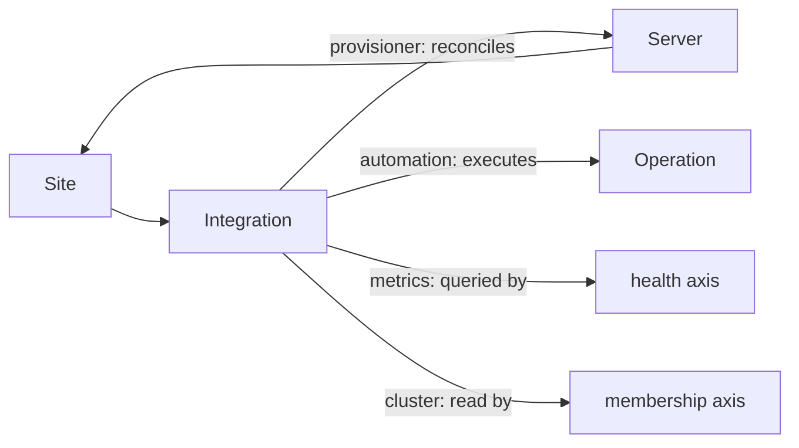

# Site and Integration

## Definition

These two concepts are the only part of the world gdcm defines rather than observes. No
external system knows the set of sites, and no external system knows which other systems
gdcm should talk to.

## Site

A physical or logical location that owns its own infrastructure: a datacenter, a
colocation cage, a lab.

A site is the frame everything else hangs off. It is what makes a fleet describable: a
[Server](server.md) belongs to a site through its source, an [Integration](#integration)
serves one site, and `site` is a required label in the
[metrics contract](../decisions/003-metrics-label-contract.md).

### Key Fields

- `siteId` — gdcm-issued, opaque, stable
- `name` — operator-facing label
- `description` — optional

Sites are deliberately thin. A site is an identifier and a name, not a model of a
building. Anything more specific about location is an attribute of the things inside it.

## Integration

A registered external system that gdcm talks to, scoped to one site.

### Kinds

| Kind | System | gdcm uses it to |
|------|--------|-----------------|
| `provisioner` | MAAS | Read machine inventory, deploy and release operating systems |
| `automation` | AWX | Launch long-running operations, mirror their status, proxy their logs |
| `metrics` | Central TSDB | Query metrics with PromQL |
| `cluster` | Kubernetes API, Slurm | Read live cluster state and membership |

### Key Fields

- `integrationId` — gdcm-issued, opaque, stable. Persisted in every
  [Server](server.md) source, so it must never be reissued for a different system
- `siteId` — the site this integration serves
- `kind` — from the table above
- `endpoint` — base URL
- `credentialRef` — a reference to the credential, never the credential itself in a
  response
- `enabled` — an integration can be registered but paused, e.g. during a maintenance window

### Credentials

An integration's credential is the one secret gdcm cannot avoid holding, because gdcm is
the thing that authenticates. Rules:

- A credential is **never** returned by any API, in any form, including redacted.
- An integration's credential is write-only: it can be replaced, never read back.
- Where the credential physically lives — an encrypted field, or a reference into an
  external secret store — is a deployment decision, not a model decision. The model only
  commits to `credentialRef` being an indirection.

## Staleness

Because gdcm caches provisioner inventory, every projection carries the freshness of its
source. Staleness is **part of the API**, not an implementation detail.

### Key Fields (per integration)

- `lastSyncStartedAt`, `lastSyncSucceededAt`
- `lastSyncError` — the reason the most recent attempt failed, null when the last attempt
  succeeded
- `syncIntervalSeconds`

A reader must always be able to tell "this site last synced 14 minutes ago" from "this
site is up to date". A view assembled from a stale source and a fresh one reports both
rather than the worse of the two, because collapsing them hides which half to distrust.

An unreachable integration does **not** change the data it last reported, and does not
make that data wrong — only old. See the "unknown is not a status value" rule in
[Server](server.md#the-three-status-axes).

## Relationships

## Out of Scope

- **Multiple sites per integration.** An integration serves exactly one site. A MAAS
  spanning two sites is modelled as two integrations, because the alternative is a
  many-to-many relationship in service of an arrangement that does not currently exist.
- **Integration discovery.** Integrations are registered by an operator. gdcm does not
  scan for them.

## Related Concepts

- [Server](server.md) — what a provisioner integration produces.
- [decision 001](../decisions/001-system-ownership-boundaries.md) — why gdcm owns these
  two concepts and almost nothing else.
