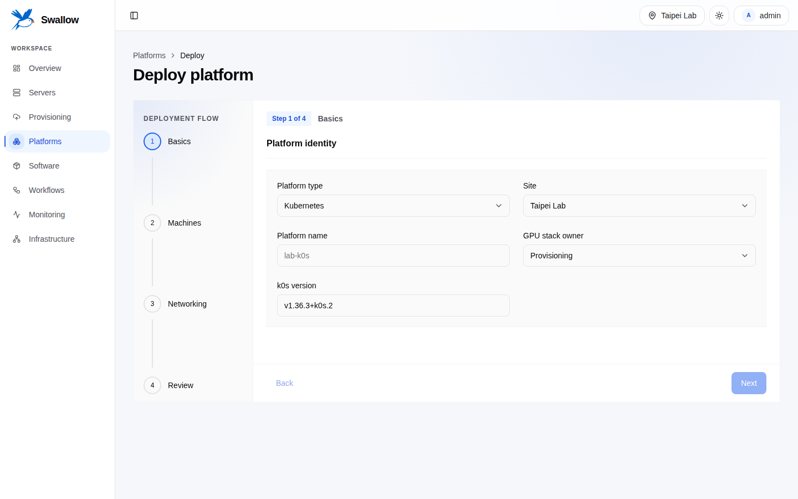

# 專案介紹

[English](../en/introduction.md) · [文件首頁](README.md)

swallow 在 provisioning、runtime Platform、host software 與 observability
之間提供統一的 identity 與 automation layer。當同一台實體 Server 在 MAAS、
Kubernetes／Slurm、Prometheus 與 automation logs 中有不同名稱或識別碼時，
swallow 可以把它們穩定地關聯起來。

## 要解決的問題

GPU 資料中心通常已經有專門系統：

- MAAS 探索 machine，並控制 power 與 OS provisioning。
- Kubernetes 或 Slurm 擁有即時 runtime membership 與 workload state。
- Prometheus 與 Alertmanager 擁有 metrics 與 alerts。
- Ansible 對 host 執行可重複的變更。

取代這些系統會失去成熟能力；完全分離則會迫使 operator 手動回答「這個
Kubernetes node 是哪台 MAAS machine、哪些 alerts 屬於它、最近是哪個 automation
改動它」。swallow 解決的是 correlation 與 intent 問題。

## Ownership model

swallow 擁有：

- Site，以及每個 Site 註冊的 Integration。
- 穩定的 Server identity 與 provider machine mapping。
- Desired policy 與 durable automation intent。
- 自行佈署的 Platform record、credential 與 lifecycle intent。
- Software Assignment，以及 resource 和 Workflow 間的關聯。

swallow 刻意不擁有：

- MAAS 已擁有的 hardware、power 或 provisioning facts。
- Kubernetes／Slurm live state。
- Time-series metrics 或 Alertmanager alert state。
- API 可讀回的第二份 credential；integration 與 automation credentials 都是 write-only。

完整邊界請見具約束力的
[system ownership decision](../decisions/001-system-ownership-boundaries.md)。

## 操作介面

- **Dashboard：** 引導式操作流程、fleet status、診斷與 resource management。
- **CLI：** 以 table、JSON、YAML 與 streaming output 提供廣泛的 operator
  能力；Managed Software 目前使用 Dashboard 或 HTTP API。
- **HTTP API：** 給 external integration 與自訂 automation 使用的 provider-owned contracts。

三種介面都以 opaque ID 作為 resource identity。Hostname 與 IP address 是可變的
observed attributes，不能當作 key。

## 主要 operator journeys

1. 建立 Site，註冊 MAAS 與 monitoring Integration。
2. 設定 Site automation，將 MAAS machines reconcile 成 Servers。
3. 檢視 inventory，以 Zone、Pool、tag 組織 Server，並佈署 OS。
4. 佈署 Kubernetes／Slurm Platform，或安裝 host-level Managed Software。
5. 從 Job、Task、event 與 log 追蹤 durable Workflow。
6. 將 live metrics 與 alerts 關聯回穩定的 Server／Platform ID。

## 非目標與目前狀態

swallow 只管理自己佈署的 Platform，不註冊任意既有 Kubernetes／Slurm 環境。
Teams、user administration、實體 rack topology 與 GPU-specific observability
仍是 planned design area，不是 active feature。

專案正在積極開發，尚無穩定 SemVer release。Compose topology 是功能完整的執行
topology；在 Temporal 與 PostgreSQL native service packaging 完成前，native
packaging 仍是 preview。
